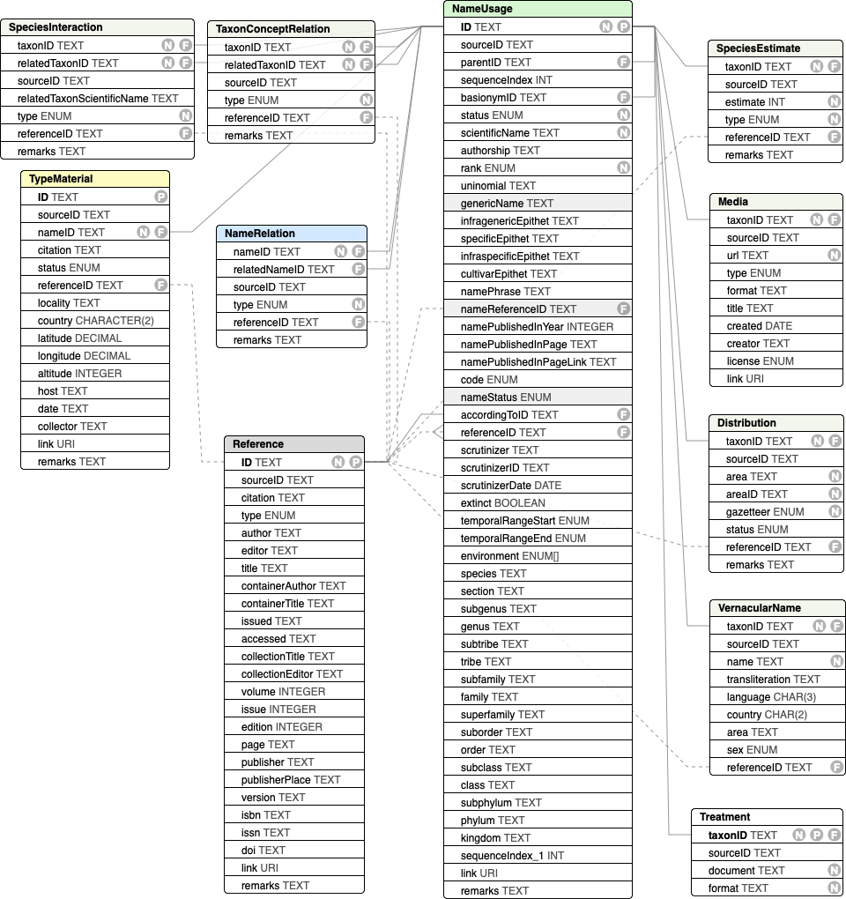

# CoL Data Package (COLDP) Specification
The recommended exchange format for data to and from the CoL Clearinghouse
is a tabular text format with a fixed set of files and columns.

The format is a single ZIP archive that bundles various delimited text files described below together with a metadata.yaml file providing basic metadata about the entire dataset. Each file holds records for the same class of things shown in this diagram:


## Format Comparison

The ColDP format was developed to overcome limitations existing in currently used formats for sharing taxonomic information, namely [Darwin Core Archives](https://dwc.tdwg.org/text/) and the Catalogue of Life submission format also known as [ACEF](http://www.catalogueoflife.org/content/contributing-your-data#ACEF) (Annual Checklist Exchange Format). Darwin Core Archives and ACEF could still be used for exchanging data to and from the Catalogue of Life clearinghouse, but the COLDP format will support the most features. The following table provides an overview of different features supported in each of the 3 formats:

Feature|ACEF|DwC-A|ColDP
 --- |:---:| :---:| :---:
Linnean classification (KPCOFG)|x|x|x
Extended Linnean classification (subranks)|-|-|x
Flexible Parent-child classification|-|x|x
Unrestricted ranks|-|x|x
Higher taxon details|-|x|x
Infraspecific taxa|x|x|x
Nested infraspecific taxa|-|x|x
Basionyms|-|x|x
Synonyms|x|x|x
Synonyms for higher taxa|-|x|x
Name identifier|-|x|x
Nomenclatural status|x|x|x
Fossils/extinction flags|x|x|x
Name & taxon separation|-|-|x
Species interactions|-|-|x
Structured references|x|-|x
Nomenclatural relations|-|-|x
Type species|-|x|x
Type specimen|-|x|x
Taxon concepts|-|x|x
Taxon concept relations|-|x|x
Vernacular names|x|x|x
Structured distributions|x|x|x
Taxon descriptions|-|x|x
Multimedia metadata|-|x|x

 - `x` = supported
 - `-` = not supported
 
## Data Files
The filename for an entity in the above diagram is a case insensitive version of the class name, any number of ignored hyphens or underscores and a known tabular text suffix. 
The suffix specifies one of the two supported tabular flavours, comma separated or tab separated files:

 - `csv`: a comma separated, optionally quoted CSV file as per [RFC 4180](https://tools.ietf.org/html/rfc4180)
 - `tsv`, `tab` or `txt`: indicates a tab seperated file without quoting
 
 Valid examples are `Taxon.tsv` or `vernacular-name.csv`

It is recommended to place all data files in a subfolder called `data`, but having them on the root level is allowed.

### Character Encoding
All files should be encoded in UTF-8.

### Entity listing:
 - [metadata.yaml](#metadatayaml)
 - [Name](#name)
 - [NameRelation](#namerelation)
 - [Taxon](#taxon)
 - [Synonym](#synonym)
 - [NameUsage](#nameusage)
 - [TaxonRelation](#taxonrelation)
 - [Reference](#reference)
 - [Reference JSON-CSL](#reference-json-csl)
 - [Reference BIBTEX](#reference-bibtex)
 - [TypeMaterial](#typematerial)
 - [Distribution](#distribution)
 - [Media](#media)
 - [VernacularName](#vernacularname)
 - [Treatment documents](#treatment)
  
## metadata.yaml
A [YAML file](https://en.wikipedia.org/wiki/YAML) with metadata about the entire data package should be included. 
The file consists mostly of key value pairs like title, see the [comments in metadata.yaml](metadata.yaml) for all available keys.
An exception are the contact and authorsAndEditors properties which takes a simple person object, see [yaml example](metadata.yaml).
Additional entries to the YAML file is allowed to express non standard properties.


# Data File Columns
All data files should contain a header row that specifies the name of the columns as given below. 
In the absence of a header row it is expected that all columns exist in the exact order given below.
With headers given it is allowed to share additional columns which are not part of the standard as listed below.


## Name
See [NAMES.md](https://github.com/Sp2000/colplus/blob/master/docs/NAMES.md) for examples and rationales.

#### ID
Unique name identifier that is referred to elsewhere via `nameID`.

#### scientificName
Required scientific name excluding the authorship

#### authorship
Authorship of the scientificName

#### rank
type: [rank enum](http://api.catalogue.life/vocab/rank)

The rank of the name preferrably given in case insensitive english. The recommended vocabulary is included in [rank_enum](http://api.catalogue.life/vocab/rank).

#### uninomial
The single-word name of generic or higher rank names.

#### genus
The genus part of a bi/trinomial. 
Note that for generic names the uninomial field should be used, not genus!

#### infragenericEpithet
The infrageneric epithet in case of bi/trinomials. In zoological names often the subgenus.

#### specificEpithet
The specific epithet in case of bi/trinomials.

#### infraspecificEpithet
The infraspecific epithet in case of bi/trinomials.

#### cultivarEpithet
The name of the cultivar for name governed by the cultivar code.

#### publishedInID
A referenceID pointing to the Reference table indicating the original publication of the name in its given combination, not the basionym.

#### publishedInPage
The exact page number within the referenced reference that the original publication of the name in its given combination starts.

#### publishedInYear
The effective year the name was published.

#### code
type: [code enum](http://api.catalogue.life/vocab/nomCode)

The nomenclatural code the name falls under.

#### originalNameID
Identifier of the name which is the original combination of this name. Also known as the basionym or protonym. 
Contrary to the strict basionym definition it is recommended to populate this field also for original names which should point to itself.

Note there is an alternative way to share the information about an original name by using a [NameRelation](#namerelation) with `type=basionym`.
The field originalNameID exists for simplicity and because it is an important information to be shared.

#### status
type: [nomStatus enum](http://api.catalogue.life/vocab/nomStatus)

The broad nomenclatural status of the name.
For the exact status note, e.g. *nomen nudum*, the remarks field should additionally be used
Alternatively a URI or simple name from a class of the [NOMEN ontology](https://github.com/SpeciesFileGroup/nomen/blob/master/src/ontology/nomen.owl) can be used.

#### link
A link to a webpage provided by the source depicting the name.

#### remarks
Additional nomenclatural remarks about the name. Often indicating its status or relevant rules in the code.


## NameRelation
A directed nomenclatural name relation.
See [NAMES.md#name-relations](https://github.com/Sp2000/colplus/blob/master/docs/NAMES.md#name-relations) for examples.

#### nameID 
The subject name this relation originates from.

#### relatedNameID
The object name this relation relates to.

#### type
type: [enum](http://api.catalogue.life/vocab/nomreltype)

The kind of directed nomenclatural relation.

#### publishedInID
The reference or nomenclatural act where this nomenclatural relation was established.

#### remarks
Remarks about the relation.


## TypeMaterial
Type material designated to names.
Type material should only be associated with the original name, not with a recombination.

#### ID
Optional unique identifier for the specimen. 
If possible use the existing specimen identifier, e.g. the collection/institution code and catalogue number.
If coming from a Darwin Core world dwc:occurrenceID is a great fit.

#### nameID
Pointer to the typified name referring to an existing Name.ID within this data package.
Type material should only be associated with an original name, not with recombinations.

#### citation
Material citation of the type material, i.e. type specimen. 
The citation is ideally given in the verbatim form as it was used in the original publication of the name or the subsequent designation. Otherwise it is recommended to follow the [material citation guidelines published by European Journal of Taxonomy](material_citations_formatting_guide.pdf).
If atomized fields below are given a citation is not needed. Otherwise it is required.

#### status
type: [type status enum](http://api.catalogue.life/vocab/typeStatus)
The status of the type material, e.g. holotype

#### referenceID
A referenceID pointing to the Reference table indicating the publication of the type designation.
Most often this is equivalent to the original publishedInID, but for subsequent designations a later reference should be cited.

#### locality
The type locality. Ideally from largest area to smallest.

#### country
The country of the type locality. Preferably as ISO codes.

#### latitude
Decimal latitude of the type locality given in WGS84

#### longitude
Decimal longitude of the type locality given in WGS84

#### altitude
Altitude of the type locality. Ideally given as meters above mean seal level.
Depth should be given as negative altitudes.

#### host
Indicates the host organism from which the type specimen was obtained (symbiotype).

#### date
Date the type material was gathered. Recommended to be given as ISO 8601 dates.

#### collector
The collectors name

#### link
A link to further information about the specimen, e.g. as provided by the institute holding the collection.

#### remarks
Any further remarks on the type material.


## Taxon
An accepted name with a taxonomic classification given either as a parent-child relation or as a flat, denormalized record.

#### ID
Unique taxon identifier that is referred to elsewhere via `taxonID`.

#### parentID
The direct parent in the classification. This is the preferred way of exchanging a hierarchy and takes precedence over any classification given in the denormalized fields.

#### nameID
Pointer to the accepted name referring to an existing Name.ID within this data package.

#### appendedPhrase
An optional, unrestricted, lose phrase appended to the name just for this taxon.
E.g. the phrase "sensu latu" may be added to the name to describe this taxon more precisely.

#### accordingToID
A reference ID to the publication that established the taxonomic concept used by this taxon.
The author & year of the reference will be used to qualify the name with `sensu AUTHOR, YEAR`.
The ID must refer to an existing Reference.ID within this data package.

#### scrutinizer
Name of the person who is the latest scrutinizer who revised or reviewed the taxonomic concept.

#### scrutinizerDate
type: [ISO8601 date](https://frictionlessdata.io/specs/table-schema/#date) 
The date when the taxonomic concept was last revised or reviewed by the scrutinizer.

#### provisional
type: [boolean](https://frictionlessdata.io/specs/table-schema/#boolean)

A flag indicating that the taxon is only provisionally accepted and should be handled with care.

#### referenceID
A comma concatenated list of reference IDs supporting the taxonomic concept that has been reviewed by the scrutinizer.
Each ID must refer to an existing Reference.ID within this data package.

#### extinct 
type: [boolean](https://frictionlessdata.io/specs/table-schema/#boolean)

Nullable flag indicating that the taxon is extinct (true) or extant (false). This includes species that died out very recently.

#### temporalRangeStart
type: [enum](http://api.catalogue.life/vocab/geotime)

Earliest appearance of the taxon in the geological time scale.
Recommended values are geochronological names from the official International Commission on Stratigraphy (ICS).

#### temporalRangeEnd
type: [enum](http://api.catalogue.life/vocab/geotime)

Latest appearance of the taxon in the geological time scale.
Recommended values are geochronological names from the official International Commission on Stratigraphy (ICS).

#### lifezone
type: [enum[]](http://api.catalogue.life/vocab/lifezone)
A comma delimited list of lifezones this taxon is known to exist in.

#### species
The species binomial the taxon is classified in.
If parentID is given this field is ignored.

#### section
The (botanical) section the taxon is classified in. Considered a botanical rank below subgenus, not a zoological above family.
If parentID is given this field is ignored.

#### subgenus
The subgenus the taxon is classified in.
If parentID is given this field is ignored.

#### genus
The genus the taxon is classified in.
If parentID is given this field is ignored.

#### subtribe
The subtribe the taxon is classified in.
If parentID is given this field is ignored.

#### tribe
The tribe the taxon is classified in.
If parentID is given this field is ignored.

#### subfamily
The subfamily the taxon is classified in.
If parentID is given this field is ignored.

#### family
The family the taxon is classified in.
If parentID is given this field is ignored.

#### superfamily
The superfamily the taxon is classified in.
If parentID is given this field is ignored.

#### suborder
The suborder the taxon is classified in.
If parentID is given this field is ignored.

#### order
The order the taxon is classified in.
If parentID is given this field is ignored.

#### subclass
The subclass the taxon is classified in.
If parentID is given this field is ignored.

#### class
The class the taxon is classified in.
If parentID is given this field is ignored.

#### subphylum
The subphylum the taxon is classified in.
If parentID is given this field is ignored.

#### phylum
The phylum the taxon is classified in.
If parentID is given this field is ignored.

#### kingdom
The kingdom the taxon is classified in.
If parentID is given this field is ignored.

#### link
A link to a webpage provided by the source depicting the taxon.

#### remarks
Any further taxonomic remarks.


## Synonym
A synonymous name for a taxon.
Note that the same name can be linked to mulitple taxa by having several Synonym records to model pro parte synonyms.

#### ID
Optional unique identifier for the synonym.
If given it should not clash with the taxon ids.

#### taxonID
Pointer to the taxon that this synonym is used for. For pro parte synonyms with multiple accepted names several synonym records sharing the same name but having different taxonIDs should be created. Refers to an existing Taxon.ID within this data package.

#### nameID 
Pointer to the synonymous name referring to an existing Name.ID within this data package.

#### appendedPhrase
An optional, unrestricted, lose phrase appended to the name just for this synonym.
E.g. the phrase "sensu latu" may be added to the name to describe this synonym more precisely.
Or "auct. mult." or "auct. amer." for misapplied names that cannot refer to a single publication.
Misapplied names that refer to a single publication should use `accordingToID` instead.

#### accordingToID
A reference ID to the publication that established the taxonomic concept used by this taxon.
The author & year of the reference will be used to qualify the name with `sensu AUTHOR, YEAR`.
Strongly recommended in case of misapplied names.
The ID must refer to an existing Reference.ID within this data package.

#### status 
type: [enum](http://api.catalogue.life/vocab/taxonomicstatus)

The kind of synonym. One of *synonym*, *ambiguous synonym* or *misapplied*.

#### referenceID
A comma concatenated list of reference IDs supporting the synonym status of the name.
Each ID must refer to an existing Reference.ID within this data package.

#### link
A link to a webpage provided by the source depicting the synonym.

#### remarks
Any further taxonomic remarks.


## NameUsage
As a simpler alternative to the 3 entities [Name](#name), [Taxon](#taxon) and [Synonym](#synonym) a single `NameUsage` entity can be supplied.
A NameUsage record can either be an accepted Taxon or a Synonym and is easily distinguished by its status. A NameUsage.ID acts both as a taxonID and nameID if referred to from other table, e.g TypeMaterial or VernacularName. For synonyms the `parentID` field is used to link to the accepted taxon.

All properties available in the individual entities can also be used for the single NameUsage:



There are two clashing properties that exist both on a Name and Taxon, but which have a slightly different meaning.
Therefore following properties deviate slightly from their usage in their classic version:
 
 - **status**: is the taxonomic name usage status which includes Synonym.status and the Taxon.provisional flag. 
 - **nameStatus**: corresponds to the nomenclatural name status.
 - **parentID**: for taxa it points to the next higher taxon to form the classification, for synonyms it points at the accepted taxon.
 - **genus**: is the taxonomic classification of a name usage and corresponds to Taxon.genus. For synonyms it often is not the same as the genus part of the name
 - **genericName**: corresponds to the genus field of a name and represents the atomized genus of a scientificName.
 
If a single NameUsage entity is given no further Name, Taxon or Synonym entity must exist.


## TaxonRelation
A directed taxon relation. 
Either a RCC5 concept relation or a species interaction.

#### taxonID 
The subject taxon this relation originates from.

#### relatedTaxonID
The object taxon this taxon relates to.

#### type
type: [enum](http://api.catalogue.life/vocab/taxreltype)

The kind of directed taxon relation, either concept or species interaction.
Species interaction types are heavily inspired by https://www.globalbioticinteractions.org and the OBO Relation Ontology http://www.ontobee.org/ontology/RO

#### referenceID
A reference where this relation was documented.

#### remarks
Remarks about the relation.


## Reference
Structured bibliographic references with a unique id to refer to from other entities.
References can be given in 3 ways of different degree of atomization that are not mutually exclusive.
The main reference file contains a full citation and 4 Dublin Core based properties that are also used in ACEF.

#### ID  
The local identifier for the reference as used in publishedIn and other fields.

#### citation
Full bibliographic citation as one single string as an alternative to the rest of the more structured fields.
If individual fields are given the full citation can be ignored.

#### author
The author(s) of the work. If multiple authors use a style that can safely be parsed.
Recommended is to list authors by comma and prefix their surname with initials.
If a comma is used to separate surname, firstname please use a semicolon to delimit individual authors.

#### title
The title of the work. In case of journal articles the article title, not the journal itself.

#### year
The year of the publication.

#### source
The title of the journal or book the work was published in. 
The source should exclude volume, edition, pages and other specifics.

#### details
All details to locate the work within the source, sometimes also referred to as collation.
That can include journal volume, edition, pages, pointer to illustrations or anything else.

#### doi
The DOI of the reference

#### link
A URL link to the reference

#### remarks
Additional comments about the reference.


## Reference JSON-CSL
In addition to the main reference file a `reference.json` file can be added to provide a JSON array of highly structured references
in the [CSL-JSON](https://citeproc-js.readthedocs.io/en/latest/csl-json/markup.html) format, e.g. as provided by CrossRef:
```
curl --location --silent --header "Accept: application/vnd.citationstyles.csl+json" https://doi.org/10.1126/science.169.3946.635
```

The `id` field in each record of the array must correspond to a Reference record with the same `ID` in the CSV file.

#### CSL-JSON example

```
[
{  
   "publisher":"Oxford University Press (OUP)",
   "published-print":{  
      "date-parts":[  
         [  
            2016
         ]
      ]
   },
   "DOI":"10.1093\/database\/baw125",
   "type":"article-journal",
   "created":{  
      "date-parts":[  
         [  
            2016,
            10,
            3
         ]
      ],
      "date-time":"2016-10-03T08:40:07Z",
      "timestamp":1475484007000
   },
   "page":"baw125",
   "source":"Crossref",
   "title":"The Global Genome Biodiversity Network (GGBN) Data Standard specification",
   "prefix":"10.1093",
   "volume":"2016",
   "author":[  
      {  
         "given":"G.",
         "family":"Droege",
         "sequence":"first",
         "affiliation":[  

         ]
      },
      {  
         "given":"K.",
         "family":"Barker",
         "sequence":"additional",
         "affiliation":[  

         ]
      },
      {  
         "given":"O.",
         "family":"Seberg",
         "sequence":"additional",
         "affiliation":[  

         ]
      },
      {  
         "given":"J.",
         "family":"Coddington",
         "sequence":"additional",
         "affiliation":[  

         ]
      },
      {  
         "given":"E.",
         "family":"Benson",
         "sequence":"additional",
         "affiliation":[  

         ]
      },
      {  
         "given":"W. G.",
         "family":"Berendsohn",
         "sequence":"additional",
         "affiliation":[  

         ]
      },
      {  
         "given":"B.",
         "family":"Bunk",
         "sequence":"additional",
         "affiliation":[  

         ]
      },
      {  
         "given":"C.",
         "family":"Butler",
         "sequence":"additional",
         "affiliation":[  

         ]
      },
      {  
         "given":"E. M.",
         "family":"Cawsey",
         "sequence":"additional",
         "affiliation":[  

         ]
      },
      {  
         "given":"J.",
         "family":"Deck",
         "sequence":"additional",
         "affiliation":[  

         ]
      },
      {  
         "given":"M.",
         "family":"D\u00f6ring",
         "sequence":"additional",
         "affiliation":[  

         ]
      },
      {  
         "given":"P.",
         "family":"Flemons",
         "sequence":"additional",
         "affiliation":[  

         ]
      },
      {  
         "given":"B.",
         "family":"Gemeinholzer",
         "sequence":"additional",
         "affiliation":[  

         ]
      },
      {  
         "given":"A.",
         "family":"G\u00fcntsch",
         "sequence":"additional",
         "affiliation":[  

         ]
      },
      {  
         "given":"T.",
         "family":"Hollowell",
         "sequence":"additional",
         "affiliation":[  

         ]
      },
      {  
         "given":"P.",
         "family":"Kelbert",
         "sequence":"additional",
         "affiliation":[  

         ]
      },
      {  
         "given":"I.",
         "family":"Kostadinov",
         "sequence":"additional",
         "affiliation":[  

         ]
      },
      {  
         "given":"R.",
         "family":"Kottmann",
         "sequence":"additional",
         "affiliation":[  

         ]
      },
      {  
         "given":"R. T.",
         "family":"Lawlor",
         "sequence":"additional",
         "affiliation":[  

         ]
      },
      {  
         "given":"C.",
         "family":"Lyal",
         "sequence":"additional",
         "affiliation":[  

         ]
      },
      {  
         "given":"J.",
         "family":"Mackenzie-Dodds",
         "sequence":"additional",
         "affiliation":[  

         ]
      },
      {  
         "given":"C.",
         "family":"Meyer",
         "sequence":"additional",
         "affiliation":[  

         ]
      },
      {  
         "given":"D.",
         "family":"Mulcahy",
         "sequence":"additional",
         "affiliation":[  

         ]
      },
      {  
         "given":"S. Y.",
         "family":"Nussbeck",
         "sequence":"additional",
         "affiliation":[  

         ]
      },
      {  
         "given":"\u00c9.",
         "family":"O'Tuama",
         "sequence":"additional",
         "affiliation":[  

         ]
      },
      {  
         "given":"T.",
         "family":"Orrell",
         "sequence":"additional",
         "affiliation":[  

         ]
      },
      {  
         "given":"G.",
         "family":"Petersen",
         "sequence":"additional",
         "affiliation":[  

         ]
      },
      {  
         "given":"T.",
         "family":"Robertson",
         "sequence":"additional",
         "affiliation":[  

         ]
      },
      {  
         "given":"C.",
         "family":"S\u00f6hngen",
         "sequence":"additional",
         "affiliation":[  

         ]
      },
      {  
         "given":"J.",
         "family":"Whitacre",
         "sequence":"additional",
         "affiliation":[  

         ]
      },
      {  
         "given":"J.",
         "family":"Wieczorek",
         "sequence":"additional",
         "affiliation":[  

         ]
      },
      {  
         "given":"P.",
         "family":"Yilmaz",
         "sequence":"additional",
         "affiliation":[  

         ]
      },
      {  
         "given":"H.",
         "family":"Zetzsche",
         "sequence":"additional",
         "affiliation":[  

         ]
      },
      {  
         "given":"Y.",
         "family":"Zhang",
         "sequence":"additional",
         "affiliation":[  

         ]
      },
      {  
         "given":"X.",
         "family":"Zhou",
         "sequence":"additional",
         "affiliation":[  

         ]
      }
   ],
   "member":"286",
   "published-online":{  
      "date-parts":[  
         [  
            2016,
            10,
            2
         ]
      ]
   },
   "container-title":"Database",
   "original-title":[  

   ],
   "language":"en",
   "link":[  
      {  
         "URL":"http:\/\/academic.oup.com\/database\/article-pdf\/doi\/10.1093\/database\/baw125\/8225125\/baw125.pdf",
         "content-type":"unspecified",
         "content-version":"vor",
         "intended-application":"similarity-checking"
      }
   ],
   "deposited":{  
      "date-parts":[  
         [  
            2017,
            8,
            25
         ]
      ],
      "date-time":"2017-08-25T02:23:14Z",
      "timestamp":1503627794000
   },
   "subtitle":[  

   ],
   "short-title":[  

   ],
   "issued":{  
      "date-parts":[  
         [  
            2016
         ]
      ]
   },
   "alternative-id":[  
      "10.1093\/database\/baw125"
   ],
   "URL":"http:\/\/dx.doi.org\/10.1093\/database\/baw125",
   "ISSN":[  
      "1758-0463"
   ],
   "container-title-short":"Database"
},

{  
   "publisher":"American Association for the Advancement of Science (AAAS)",
   "issue":"3946",
   "published-print":{  
      "date-parts":[  
         [  
            1970,
            8,
            14
         ]
      ]
   },
   "DOI":"10.1126\/science.169.3946.635",
   "type":"article-journal",
   "created":{  
      "date-parts":[  
         [  
            2006,
            10,
            5
         ]
      ],
      "date-time":"2006-10-05T12:56:56Z",
      "timestamp":1160053016000
   },
   "page":"635-641",
   "source":"Crossref",
   "title":"The Structure of Ordinary Water: New data and interpretations are yielding new insights into this fascinating substance",
   "prefix":"10.1126",
   "volume":"169",
   "author":[  
      {  
         "given":"H. S.",
         "family":"Frank",
         "sequence":"first",
         "affiliation":[  

         ]
      }
   ],
   "member":"221",
   "container-title":"Science",
   "original-title":[  

   ],
   "language":"en",
   "link":[  
      {  
         "URL":"https:\/\/syndication.highwire.org\/content\/doi\/10.1126\/science.169.3946.635",
         "content-type":"unspecified",
         "content-version":"vor",
         "intended-application":"similarity-checking"
      }
   ],
   "deposited":{  
      "date-parts":[  
         [  
            2016,
            12,
            23
         ]
      ],
      "date-time":"2016-12-23T19:54:07Z",
      "timestamp":1482522847000
   },
   "subtitle":[  

   ],
   "short-title":[  

   ],
   "issued":{  
      "date-parts":[  
         [  
            1970,
            8,
            14
         ]
      ]
   },
   "journal-issue":{  
      "published-print":{  
         "date-parts":[  
            [  
               1970,
               8,
               14
            ]
         ]
      },
      "issue":"3946"
   },
   "URL":"http:\/\/dx.doi.org\/10.1126\/science.169.3946.635",
   "relation":{  

   },
   "ISSN":[  
      "0036-8075",
      "1095-9203"
   ],
   "container-title-short":"Science"
}
]
```

## Reference BIBTEX
Alternatively to CSL-JSON a [BibTex](http://www.bibtex.org/Format/) file `reference.bib` can be given to provide highly structured citations.
The id field following the curly opening bracket must correspond to a record ID from the reference.csv file.


#### Bibtex example
```
 @article{Droege_2016, 
 	title={The Global Genome Biodiversity Network (GGBN) Data Standard specification}, 
 	volume={2016}, 
 	ISSN={1758-0463}, 
 	url={http://dx.doi.org/10.1093/database/baw125}, 
 	DOI={10.1093/database/baw125}, 
 	journal={Database}, 
 	publisher={Oxford University Press (OUP)}, 
 	author={Droege, G. and Barker, K. and Seberg, O. and Coddington, J. and Benson, E. and Berendsohn, W. G. and Bunk, B. and Butler, C. and Cawsey, E. M. and Deck, J. and et al.}, 
 	year={2016}, 
 	pages={baw125}
}

@article{Frank_1970, 
 	title     = {The Structure of Ordinary Water: New data and interpretations are yielding new insights into this fascinating substance}, 
 	volume    = {169}, 
 	ISSN      = {1095-9203}, 
 	url       = {http://dx.doi.org/10.1126/science.169.3946.635}, 
 	DOI       = {10.1126/science.169.3946.635}, 
 	number    = {3946}, 
 	journal   = {Science}, 
 	publisher = {American Association for the Advancement of Science (AAAS)}, 
 	author    = {Frank, H. S.}, 
 	year      = {1970}, 
 	month     = {Aug}, 
 	pages     = {635–641}
}
```


## Distribution
A structured distribution record for a taxon in a given area.

#### taxonID 
Pointer to the taxon referring to an existing Taxon.ID within this data package.

#### area 
The geographic area this distribution record is about.

#### gazetteer
type: [enum](http://api.catalogue.life/vocab/gazetteer)

The geographic gazetteer the area is defined in.

#### status 
type: [enum](http://api.catalogue.life/vocab/distributionstatus)
Distribution status.

#### referenceID
Pointer to the reference that supports this distribution. Refers to an existing Reference.ID within this data package.


## Media
Multimedia items for a taxon such as an image, audio or video.

#### taxonID 
Pointer to the taxon referring to an existing Taxon.ID within this data package.

#### url 
The URL that resolves to the media item itself, not a webpage that depicts it.

#### type
The MIME-type of the media item the url identifies.
Preferrably the full type/subtype combination, e.g `image/jpeg`, but the primary type alone is sufficient (`image`, `video`, `audio`).

#### title
Optional title for the item.

#### created
type: [ISO8601 date](https://frictionlessdata.io/specs/table-schema/#date) 
Date the media item was recorded.

#### creator
Author of the media item.

#### license
type: [license](http://api.catalogue.life/vocab/license) 

#### link
Optional webpage from the source this media item is shown on.


## VernacularName
A vernacular or common name for a taxon.

#### taxonID 
Pointer to the taxon referring to an existing Taxon.ID within this data package.

#### name 
The vernacular name in the original script.

#### transliteration
An optional transliteration of the vernacular name into the latin script.

#### language
Language of the vernacular name given as an ISO 639-3 letter code.

#### country
Country this vernacular name is used in given as an ISO 3166-2 letter code.

#### area
Optional area describing the geographic use of the vernacular name in free text within the given country.

#### sex
type: [enum](http://api.catalogue.life/vocab/sex)

Optional sex of the organism this vernacular name is restricted to.

#### referenceID
Pointer to the reference that supports this vernacular name. Refers to an existing Reference.ID within this data package.


## Treatment
[Treatments](http://plazi.org/api-tools/api/#What_is_a_treatment) are parts of publications that "treat" a single taxon. They can be an original description for a new species, but also subsequent taxonomic works and usually include several sections such as a diagnosis, description, material examied, distribution, etc.
ColDP captures an entire treatment either as an TXT, HTML or XML document that lives as an individual file in a subfolder `treatments` and is named by the corresponding taxonID of the name usage it describes. The taxons `accordingToID` should always point to the reference the treatment is published in.
Example: `treatments/19854332.html` would be an html document which is the marked up treatment for the taxon with ID `19854332`.


