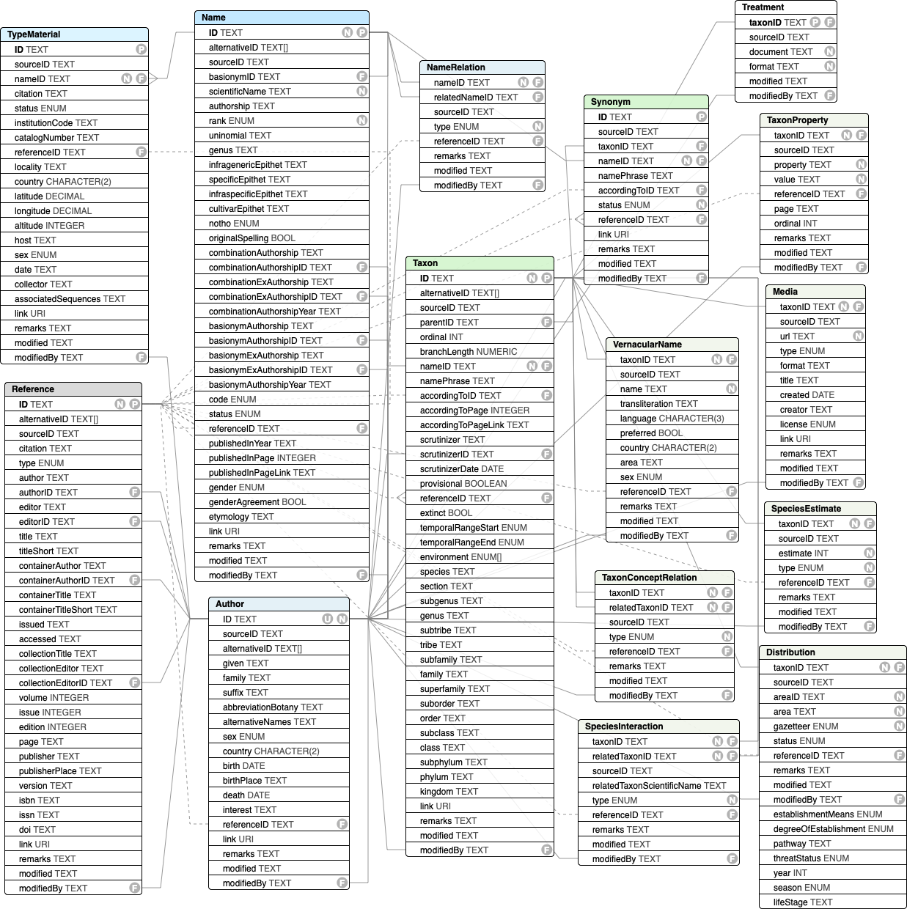
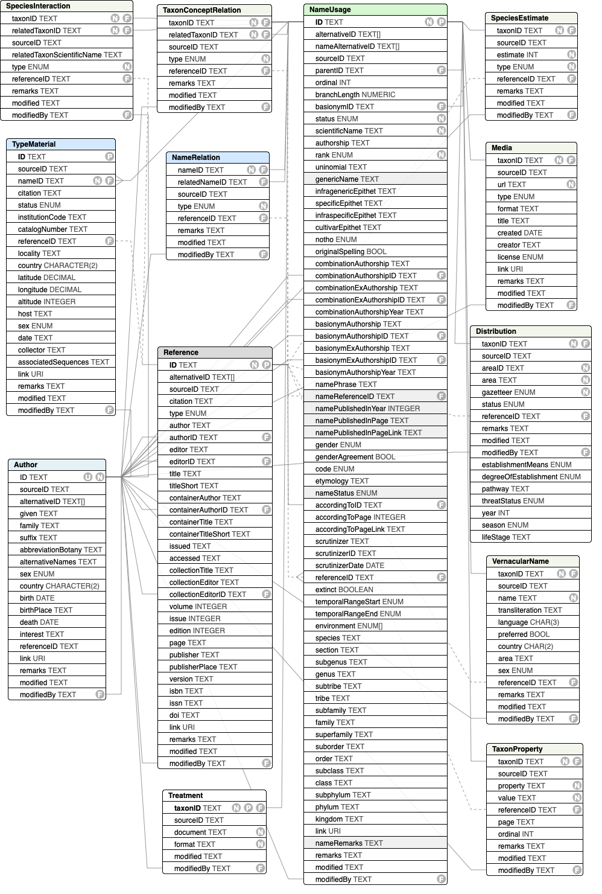

# COL Data Package (ColDP) Specification
The recommended exchange format for data to and from COL ChecklistBank
is a tabular text format with a fixed set of files and columns.

* [Status & Versioning](status-versioning)
* [Schema](#schema)
* [Archive Files](#archive-files)
* [Default Values](#default-values)
* [Dataset Metadata](#metadata)
* [Document Changes](#changes)
* [Raw Source Data](#raw-source-data)
* [Identifiers](#identifiers)
* [Format Comparison](#format-comparison)
* [Publishing Guidelines](/docs/publishing-guide.md)
* [Best Practises](#best-practices)

## Status & Versioning

### Latest Stable Release
**Version 1.1 of ColDP has been released on [September 26th 2024](https://github.com/CatalogueOfLife/coldp/releases/tag/v1.1.0)**.


### Development Branch
**Version 1.2 of ColDP is still under development** 
and new fields are marked as such in the documentation below.

There is no guarantee that these fields might still change until the version is released.
[ChecklistBank](https://www.checklistbank.org) tries it's best to support already all new features, so it can be used already.


### Versioning
ColDP adheres to [semantic versioning](http://semver.org/):
 - **patch** changes (1.0.x) do not alter the exchange schema at all. No more fields or entities will be renamed, removed or added. The documentation and enumeration of values are allowed to change.
 - **minor** changes (1.x.0) preserve backwards compatibility. Fields or entities can be added, but not renamed or removed.
 - **major** changes (x.0.0) break backwards compatibility. Fields or entities can be renamed, removed, added or changed in semantics. 
 
### History
All [changes](CHANGES.md) are documented since the initial 1.0.0 release.

 - ColDP 1.1.0, [September 26, 2024](https://github.com/CatalogueOfLife/coldp/releases/tag/v1.1.0).
 - ColDP 1.0.1, [April 7, 2022](https://github.com/CatalogueOfLife/coldp/releases/tag/v1.0.1).
 - ColDP 1.0.0, [October 25, 2021](https://github.com/CatalogueOfLife/coldp/releases/tag/v1.0.0).


## Schema

The ColDP format is a single ZIP archive that bundles various delimited text files described below together with a metadata.yaml file 
providing basic metadata about the entire dataset. 
Each file holds records for the same class of things shown in this diagram with columns explained in more detail in the [Data File section](#data-file-columns).
It aligns closely to the Frictionless Tabular Data Package for which we provide a [descriptor](http://api.catalogueoflife.org/datapackage).



For simpler sharing ColDP also offers a merged [NameUsage](#nameusage) entity, 
which combines fields from the [Taxon](#taxon), [Synonym](#synonym) and [Name](#name) entity:



## Archive Files
A ColDP archive consists of several files in a folder.
These are either data files corresponding to the schema diagram above:
 
 - [Name](#name)
 - [Author](#author)
 - [NameRelation](#namerelation)
 - [Taxon](#taxon)
 - [Synonym](#synonym)
 - [NameUsage](#nameusage)
 - [TaxonProperty](#taxonproperty)
 - [TaxonConceptRelation](#taxonconceptrelation)
 - [SpeciesInteraction](#speciesinteraction)
 - [SpeciesEstimate](#speciesestimate)
 - [Reference](#reference)
 - [Reference JSON-CSL](#reference-json-csl)
 - [Reference BIBTEX](#reference-bibtex)
 - [TypeMaterial](#typematerial)
 - [Distribution](#distribution)
 - [Media](#media)
 - [VernacularName](#vernacularname)
 - [Treatment documents](#treatment)

or the following:
 - [metadata.yaml](#metadatayaml)
 - [CHANGES.md](#changes)
 - `logo.png` a logo image for the dataset


### Data Files
The filename for an entity in the above diagram is a case insensitive version of the class name, any number of ignored hyphens or underscores and a known tabular text suffix. The suffix specifies one of the two supported tabular flavours, comma separated or tab separated files:

 - `csv`: a comma separated, optionally quoted CSV file as per [RFC 4180](https://tools.ietf.org/html/rfc4180)
 - `tsv`, `tab` or `txt`: indicates a tab separated file without quoting
 
Valid examples are `Taxon.tsv` or `vernacular-name.csv`
`tsv` files are simpler to produce and handle, so if you have the option we recommend `tsv` over `csv`.

### Quoting and Escaping
`tsv` files do not have any quoting of values, i.e. values are represented as they are. There are just 2 characters that are special and one needs to escape to not break the format: `\t` tabs and `\n` new lines. As they are hardly ever important in ColDP data (they most often are dirty data) the simplest solution is to just replace them with an ordinary space if they appear in any value.

Otherwise `tsv` offers escaping  `\t`, `\n`, `\r` and `\` itself using the backslash `\` if you really want to keep these characters in your values.


`csv` files use a comma as the delimiter which often also appears in values. The optional quoting of values using double quotes `"` at the beginning and end of the value allows to safely use a comma without escaping it. E.g. `1234,"Miller, 1887"` are 2 columns. That pushes the problem to the double quote symbol which then has to be escaped inside quoted values by doubling it, e.g. `1234,"Frederic ""The Great"", 1887"`. Here are the important rules from the [RFC 4180 specification](https://tools.ietf.org/html/rfc4180)


>   4.  Within the header and each record, there may be one or more
       fields, separated by commas.  Each line should contain the same
       number of fields throughout the file.  Spaces are considered part
       of a field and should not be ignored.  The last field in the
       record must not be followed by a comma.  For example:

       ```
       aaa,bbb,ccc
       ```

>   5.  Each field may or may not be enclosed in double quotes (however
       some programs, such as Microsoft Excel, do not use double quotes
       at all).  If fields are not enclosed with double quotes, then
       double quotes may not appear inside the fields.  For example:

       ```
       "aaa","bbb","ccc" CRLF
       zzz,yyy,xxx
       ```

>   6.  Fields containing line breaks (CRLF), double quotes, and commas
       should be enclosed in double-quotes.  For example:

       ```
       "aaa","b CRLF
       bb","ccc" CRLF
       zzz,yyy,xxx
       ```

>   7.  If double-quotes are used to enclose fields, then a double-quote
       appearing inside a field must be escaped by preceding it with
       another double quote.  For example:

       ```
       "aaa","b""bb","ccc"
       ```

### Character Encoding
All files **must be encoded in UTF-8**.


## Default Values
*added in v1.1*

In some cases it is useful to declare a fixed, global value that applies to every record in the dataset,
for example if all taxa are animals it makes sense to declare `Name.code=zoological` only once.
This can be done in a single file default.yaml that provides default values for all terms. 
Term  are organised under their entity/class name in the file.

Example of a `default.yaml` file:

```yaml
Name:
  code: zoological
Taxon:
  extinct: false
  environment: marine
  kingdom: Animalia
```

If the term is defined in the actual data, default values will only apply in case the value is null. 
E.g. it can be used to have a default *code* value, but override it for exceptional records.
This is similar to the default feature in the meta.xml file of DwC archives.


## Metadata
A [YAML file](metadata.yaml) called `metadata.yaml` with metadata about the entire data package should be included. 
The file consists mostly of key value pairs like title, see the comments in [metadata.yaml](metadata.yaml) for all available keys.
There is also a [JSON schema](metadata.json) available for validation.

An exception are the contact and authors and editors properties which takes a compound person object 
and the organisations list which takes a structured organisation object. 
See [yaml example](metadata.yaml) for all available fields.
Additional entries to the YAML file are allowed to express non standard properties.

Note that there is no single preformatted citation string, but instead the structured metadata itself is the citation
which can be formatted according to [various styles](https://www.zotero.org/styles) like [APA](https://apastyle.apa.org/products/publication-manual-7th-edition) which is the default style in checklistbank.org.
For citations please pay special attention to the core fields `title`, `creator`, `editor`, `publisher` & `issued`.

## Changes
To document past versions and changes in data it is recommended
to include a dedicated changelog markdown file named `CHANGES.md`.
See https://keepachangelog.com/en/1.0.0/ for best practices.


## Raw Source Data
In many cases it is desirable to also include the raw source data files like PDFs, Excel spreadsheets, database dumps, XML files 
or any other custom or binary files inside the archive.
This allows users interested in details not captured by ColDP to access them, but also
improves transparency and increases trust. 

ColDP recommends to use a special `raw` folder to hold all the original source files.
Please always consider the resulting total archive size and consider the inclusion of very large raw files if the total archive size exceeds 1GB.


# Data File Columns
All data files should contain a header row that specifies the name of the columns as given below. 
In the absence of a header row it is expected that all columns exist in the exact order given below.
With headers given it is allowed to share additional columns which are not part of the standard as listed below.


## Name
Names can be shared in a structured way using various fields, 
but rank, scientificName and authorship alone are sufficient.
See [](https://github.com/Sp2000/colplus/blob/master/docs/) for examples and rationales.

A structured `scientificName` can be given using the following fields:
 - [uninomial](#uninomial)
 - [genus](#genus)
 - [infragenericEpithet](#infragenericEpithet)
 - [specificEpithet](#specificEpithet)
 - [infraspecificEpithet](#infraspecificEpithet)
 - [cultivarEpithet](#cultivarEpithet)
 - [notho](#notho)

An `authorship` of a name can be structured with:
 - [combinationAuthorship](#combinationAuthorship)
 - [combinationExAuthorship](#combinationExAuthorship)
 - [combinationAuthorshipYear](#combinationAuthorshipYear)
 - [basionymAuthorship](#basionymAuthorship)
 - [basionymExAuthorship](#basionymExAuthorship)
 - [basionymAuthorshipYear](#basionymAuthorshipYear)

 or can make use of the [Author](#author) entity and define authorships purely by using identifiers:
 - [combinationAuthorshipID](#combinationAuthorshipID)
 - [combinationExAuthorshipID](#combinationExAuthorshipID)
 - [combinationAuthorshipYear](#combinationAuthorshipYear)
 - [basionymAuthorshipID](#basionymAuthorshipID)
 - [basionymExAuthorshipID](#basionymExAuthorshipID)
 - [basionymAuthorshipYear](#basionymAuthorshipYear)

#### ID
Unique name identifier that is referred to elsewhere via `nameID`.

#### alternativeID
A comma concatenated list of alternative identifiers for the name.
Every alternative identifier must be a URI/URN/URL or given in the form of `scope:id`. 
See [identifiers](#Identifiers) for all details and common scopes.

*added in v1.1*

#### sourceID
Optional identifier for the source this record came from as listed in the [metadata.yaml](metadata.yaml)

#### basionymID
Identifier of the name which is the original combination of this name. Also known as the basionym. 
Contrary to the strict basionym definition it is acceptable to populate this field also for original names which should point to itself.
A basionym is a terminal relationship which cannot be "chained". 
The original name itself should not have another basionym relation to another name.
When the basionym was established as a nomen novum to replace another name, e.g. a homonym, 
it should not use basionymID to refer to the replaced name (which has an entirely different epithet), 
but use the [NameRelation](#namerelation) with `type=replacement name` instead.

Note there is an alternative way to share the information about an original name by using a [NameRelation](#namerelation) with `type=basionym`.
The field basionymID exists for simplicity and because it is an important information to be shared.

#### scientificName
Required scientific name excluding the authorship

#### authorship
Authorship of the scientificName

#### rank
type: [rank enum](http://api.checklistbank.org/vocab/rank)

The rank of the name preferably given in case insensitive english. The recommended vocabulary is included in [rank_enum](http://api.checklistbank.org/vocab/rank).

#### uninomial
The single-word name of generic or higher rank names.

#### genus
The genus part of a bi/trinomial. 
Note that for generic names the uninomial field should be used, not genus!

#### infragenericEpithet
The infrageneric epithet. Used as the terminal epithet for names at infrageneric ranks and optionally also for bi/trinomials
In zoological names often the subgenus.

#### specificEpithet
The specific epithet in case of bi/trinomials.

#### infraspecificEpithet
The infraspecific epithet in case of bi/trinomials.

#### cultivarEpithet
The name of the cultivar for name governed by the cultivar code.

#### notho
For named hybrids the part of the name which is considered a hybrid
and which usually is prefixed with the hybrid marker `×`. One of:

 - generic
 - infrageneric
 - specific
 - infraspecific

type: [namePart enum](https://api.checklistbank.org/vocab/namePart)

*added in v1.1*

#### combinationAuthorship
The authorteam of the main authorship for the exact combination (not the original combination).
Multiple authors should be concatenated with a pipe `|` symbol.

*added in v1.1*

#### combinationAuthorshipID
A list of identifiers for authors of the exact combination (not the original combination).
Multiple author identifiers should be concatenated with a pipe `|` symbol.
If `combinationAuthorship` is given, the order and number of author names and identifiers must always match up.
Author identifiers must refer to an existing Author.ID within this data package.

*added in v1.1*

#### combinationExAuthorship
The ex-authors part of the main authorship for the very combination (not the original combination).
The `ex` prefix as normally found in the authorship should not be included here.
Multiple authors should be concatenated with a pipe `|` symbol.

*added in v1.1*

#### combinationExAuthorshipID
A list of identifiers for ex-authors of the exact combination (not the original combination).
Multiple author identifiers should be concatenated with a pipe `|` symbol.
If `combinationExAuthorship` is given, the order and number of author names and identifiers must always match up.
Author identifiers must refer to an existing Author.ID within this data package.

*added in v1.1*

#### combinationAuthorshipYear
The year given in the authorship for the very combination (not the original combination), given without brackets.

*added in v1.1*

#### basionymAuthorship
The authorteam of the original name normally found in brackets, but given here without brackets.
Multiple authors should be concatenated with a pipe `|` symbol.

*added in v1.1*

#### basionymAuthorshipID
A list of identifiers for authors of the original combination (basionym) normally found in brackets.
Multiple author identifiers should be concatenated with a pipe `|` symbol.
If `basionymAuthorship` is given, the order and number of author names and identifiers must always match up.
Author identifiers must refer to an existing Author.ID within this data package.

*added in v1.1*

#### basionymExAuthorship
The ex-authors of the original name normally found in brackets, but given here without brackets.
The `ex` prefix as normally found in the authorship should not be included here.
Multiple authors should be concatenated with a pipe `|` symbol.

*added in v1.1*

#### basionymExAuthorshipID
A list of identifiers for ex-authors of the original combination (basionym) normally found in brackets.
Multiple author identifiers should be concatenated with a pipe `|` symbol.
If `basionymExAuthorship` is given, the order and number of author names and identifiers must always match up.
Author identifiers must refer to an existing Author.ID within this data package.

*added in v1.1*

#### basionymAuthorshipYear
The year given in the authorship for the original combination normally found in brackets, but given here without brackets.

*added in v1.1*


#### code
type: [code enum](http://api.checklistbank.org/vocab/nomCode)

The nomenclatural code the name falls under.

#### status
type: [nomStatus enum](http://api.checklistbank.org/vocab/nomStatus)

The broad nomenclatural status of the name.
For the exact status note, e.g. *nomen nudum*, the remarks field should additionally be used
Alternatively a URI or simple name from a class of the [NOMEN ontology](https://github.com/SpeciesFileGroup/nomen/blob/master/src/ontology/nomen.owl) can be used.

#### referenceID
A pointer to a Reference that is the publication in which the scientificName was originally established 
under the rules of the associated nomenclatural code. 

#### publishedInYear
The effective year the name was published, given as a 4 digit integer. 
It is the year that is nomenclaturally relevant for the given combination.
In most cases this will be the same as the publication year given in the linked reference record via referenceID.
But in some cases this might be different.

#### publishedInPage
The exact single page number where the name was published.
If the description spans multiple pages, the first page should be given.

#### publishedInPageLink
A URL to the exact page where the name was published.
If the description spans multiple pages, the link to the first page should be given.

#### gender
type: [gender enum](http://api.checklistbank.org/vocab/gender)

Gender of the name, i.e. the genus in case of bi/trinomials.
Values for the gender field should be one of `masculine`, `feminine` or `neuter`.

*added in v1.1*

#### genderAgreement
type: [boolean](https://frictionlessdata.io/specs/table-schema/#boolean)

Flag that indicates for bi/trinomials whether the (infra)species epithet must follow and agree with the gender of the genus.

*added in v1.1*

#### originalSpelling
type: [boolean](https://frictionlessdata.io/specs/table-schema/#boolean)

Flag indicating that the name is given in it's original spelling when an emendation exists.
Only use the flag if there is a known correction existing.
The originalSpelling is usually indicated by placing [sic] after the name.

A `originalSpelling=false` flag instead is indicating that the name is a corrected spelling, 
usually indicated by placing `corrig.` after the name.

In most cases when it is unknown or the original spelling was never revised leave this flag empty.

*added in v1.1*

#### etymology
Etymology of the name, i.e. the origin or meaning of the words forming the scientific name.
Should be a short human readable paragraph.

*added in v1.1*

#### link
A link to a webpage provided by the source depicting the name.

#### remarks
Additional nomenclatural remarks about the name. Often indicating its status or relevant rules in the code.

#### modified
UTC timestamp in ISO format to represent the time the record was last modified.

*added in v1.1*

#### modifiedBy
Author identifier indicating the person who has last modified the record.

*added in v1.1*


## Author
Normalised and structured authors that can be referred to by names, references and taxon scrutinizers.
All entities also allow to specify a modifedBy field which must reference an Author identifier here.

*added in v1.1*


#### ID
Unique identifier for the author / person. 
Can be referenced from any modifiedBy field.

#### sourceID
Optional identifier for the source this record came from as listed in the [metadata.yaml](metadata.yaml)

#### alternativeID
A comma concatenated list of alternative identifiers for the author.
Every alternative identifier must be in the form of `scope:id`. 
See [identifiers](#Identifiers) for all details and common scopes.
Recommended identifier scopes for authors are orcid, ipni, wikidata & viaf.

#### given
List of given names, concatenated by a comma.

#### family
The family name including any leading particles if existing.

#### suffix
Optional suffix to distinguish persons with identical surnames.
In well known cases of father and son, the son should be distinguished by ‘f.’ or ‘filius’ in the suffix. 

#### abbreviationBotany
Standard form (official abbreviation) of the persons name for use in a botanical author citation.

#### alternativeNames
A `|` separated list of alternative names this person is known under.

#### sex
Biological sex of the person.

#### country
Country of citizenship. Preferably as ISO code.
If multiple concatenated by a comma.

#### birth
Date of birth, given as an ISO date string.

#### birthPlace
Location the person was born at.

#### death
Date of death, given as an ISO date string.

#### affiliation
Institution(s) the author is affiliated with.

#### interest
List of taxonomic groups the person has worked on.

#### referenceID
List of sources where the information was taken from or further information can be found about the author.

#### link
A link to a webpage provided by the source depicting the author.

#### remarks
Remarks about the person.

#### modified
UTC timestamp in ISO format to represent the time the record was last modified.

*added in v1.1*

#### modifiedBy
Author identifier indicating the person who has last modified the record.

*added in v1.1*


 
## NameRelation
A directed nomenclatural name relation.
See [#name-relations](https://github.com/Sp2000/colplus/blob/master/docs/#name-relations) for examples and definitions.

#### nameID
The subject name this relation originates from.
Refers to an existing Name.ID or NameUsage.ID within this data package.

#### relatedNameID
The object name this relation relates to.
Refers to an existing Name.ID or NameUsage.ID within this data package.

#### sourceID
Optional identifier for the source this record came from as listed in the [metadata.yaml](metadata.yaml)

#### type
type: [enum](http://api.checklistbank.org/vocab/nomreltype)

The kind of directed nomenclatural relation.

#### referenceID
The reference or nomenclatural act where this nomenclatural relation was established.

#### page
The exact single page number where the nomenclatural relation was published in the linked reference.
If the value spans multiple pages, the first page should be given.

*added in v1.1*

#### remarks
Remarks about the relation.

#### modified
UTC timestamp in ISO format to represent the time the record was last modified.

*added in v1.1*

#### modifiedBy
Author identifier indicating the person who has last modified the record.

*added in v1.1*


## TypeMaterial
Type material designated to names.
Type material should only be associated with the original name, not with a recombination.

#### ID
Optional unique identifier for the specimen. 
If possible use the existing specimen identifier, e.g. the collection/institution code and catalogue number.
If coming from a Darwin Core world dwc:occurrenceID is a great fit.

#### sourceID
Optional identifier for the source this record came from as listed in the [metadata.yaml](metadata.yaml)

#### nameID
A comma concatenated list of name IDs pointing to the typified name of this specimen.
Each ID must refer to an existing Name.ID within this data package.
See [best practices](#best-practices) for details on how to concatenate multi values.

#### citation
Material citation of the type material, i.e. type specimen. 
The citation is ideally given in the verbatim form as it was used in the original publication of the name or the subsequent designation. Otherwise it is recommended to follow the [material citation guidelines published by European Journal of Taxonomy](docs/material_citations_formatting_guide.pdf).
If atomized fields below are given a citation is not needed. Otherwise it is required.

#### status
type: [type status enum](http://api.checklistbank.org/vocab/typeStatus)
The status of the type material, e.g. holotype

In case multiple names have been linked to the specimen through concatenated values in nameID,
a list of comma concatenated status values can be given in the same order as the name IDs.
If a single value is given it will be used for all names.

#### referenceID
A referenceID pointing to the Reference table indicating the publication of the type designation.
Most often this is equivalent to the original names referenceID, but for subsequent designations a later reference should be cited.

#### page
The exact single page number where the type designation was published in the linked reference.
If the value spans multiple pages, the first page should be given.

*added in v1.1*

#### locality
The type locality. Ideally from largest area to smallest.

#### country
The country of the type locality. Preferably as ISO codes.

#### latitude
Decimal latitude of the type locality given in WGS84

#### longitude
Decimal longitude of the type locality given in WGS84

#### altitude
Altitude of the type locality. Ideally given as meters above mean seal level.
Depth should be given as negative altitudes.

#### host
Indicates the host organism from which the type specimen was obtained (symbiotype).

#### date
Date the type material was gathered. Recommended to be given as ISO 8601 dates.

#### collector
The collectors name

#### institutionCode
The name or acronym in use by the institution having custody of the material.

*added in v1.1*

#### catalogNumber
The identifier for the specimen in a collection.

*added in v1.1*

#### associatedSequences
*added in v1.1*

#### sex
*added in v1.1*

#### link
A link to further information about the specimen, e.g. as provided by the institute holding the collection.

#### remarks
Any further remarks on the type material.

#### modified
UTC timestamp in ISO format to represent the time the record was last modified.

*added in v1.1*

#### modifiedBy
Author identifier indicating the person who has last modified the record.

*added in v1.1*


## Taxon
An accepted name with a taxonomic classification given either as a parent-child relation or as a flat, denormalized record.

#### ID
Unique taxon identifier that is referred to elsewhere via `taxonID`.

#### alternativeID
A comma concatenated list of alternative identifiers for the taxonomic concept.
Every alternative identifier must be a URI/URN/URL or given in the form of `scope:id`. 
See [identifiers](#Identifiers) for all details and common scopes.

*added in v1.1*

#### sourceID
Optional identifier for the source this record came from as listed in the [metadata.yaml](metadata.yaml)

#### parentID
The direct parent taxon's ID in the classification. This is the preferred way of exchanging a hierarchy and takes precedence over any classification given in the denormalized fields.

#### ordinal
A integer to specify an optional custom sort order for sibling taxa sharing the same parentID in the datasets.
This can be used to define a traditional ordering of orders and families for example and can be existing for parts of the dataset, e.g. higher ranks, only. The natural ordering of integers from small to large should be applied.
Not that this does not have to be a unique, global index.

#### branchLength
type: [number]
The optional length of the parent edge to represent phylogenetic trees.

#### nameID
Pointer to the accepted name referring to an existing Name.ID within this data package.

#### namePhrase
An optional, unrestricted, lose phrase appended to the name just for this taxon.
E.g. the phrase "sensu lato" may be added to the name to describe this taxon more precisely.

#### accordingToID
A reference ID to the publication that established the taxonomic concept used by this taxon.
The author & year of the reference will be used to qualify the name with `sensu AUTHOR, YEAR`.
The ID must refer to an existing Reference.ID within this data package.

#### accordingToPage
The exact single page number where the taxonomic concept was treated.
If the treatment spans multiple pages, the first page should be given. 

*added in v1.1*

#### accordingToPageLink
A URL to the exact page where the taxonomic concept was published.
If the treatment spans multiple pages, the link to the first page should be given.

*added in v1.1*

#### scrutinizer
Name of the person who is the latest scrutinizer who revised or reviewed the taxonomic concept.

#### scrutinizerID
Identifier for the scrutinizer. Highly recommended are [ORCID](https://orcid.org) ids.

#### scrutinizerDate
type: [ISO8601 date](https://frictionlessdata.io/specs/table-schema/#date) 
The date when the taxonomic concept was last revised or reviewed by the scrutinizer.

#### provisional
type: [boolean](https://frictionlessdata.io/specs/table-schema/#boolean)

A flag indicating that the taxon is only provisionally accepted and should be handled with care.

#### referenceID
A comma concatenated list of reference IDs supporting the taxonomic concept that has been reviewed by the scrutinizer.
Each ID must refer to an existing Reference.ID within this data package.
See [best practices](#best-practices) for details on how to concatenate multi values.

#### extinct
type: [boolean](https://frictionlessdata.io/specs/table-schema/#boolean)

Nullable flag indicating that the taxon is extinct (true) or extant (false). This includes species that died out recently.

#### temporalRangeStart
type: [enum](http://api.checklistbank.org/vocab/geotime)

Earliest appearance of the taxon in the geological time scale.
Recommended values are geochronological names from the official [International Commission on Stratigraphy (ICS)](https://stratigraphy.org/chart)
or million years before present, given with the unit `Ma` after the number, e.g. `17.4 Ma`.

#### temporalRangeEnd
type: [enum](http://api.checklistbank.org/vocab/geotime)

Latest appearance of the taxon in the geological time scale.
Recommended values are geochronological names from the official [International Commission on Stratigraphy (ICS)](https://stratigraphy.org/chart)
or million years before present, given with the unit `Ma` after the number, e.g. `17.4 Ma`.

#### environment
type: [enum[]](http://api.checklistbank.org/vocab/environment)
A comma delimited list of environments this taxon is known to exist in.

#### species
The species binomial the taxon is classified in.
If parentID is given this field is ignored.

#### section
The (botanical) section the taxon is classified in. Considered a botanical rank below subgenus, not a zoological above family.
If parentID is given this field is ignored.

#### subgenus
The subgenus the taxon is classified in.
If parentID is given this field is ignored.

#### genus
The genus the taxon is classified in.
If parentID is given this field is ignored.

#### subtribe
The subtribe the taxon is classified in.
If parentID is given this field is ignored.

#### tribe
The tribe the taxon is classified in.
If parentID is given this field is ignored.

#### subfamily
The subfamily the taxon is classified in.
If parentID is given this field is ignored.

#### family
The family the taxon is classified in.
If parentID is given this field is ignored.

#### superfamily
The superfamily the taxon is classified in.
If parentID is given this field is ignored.

#### suborder
The suborder the taxon is classified in.
If parentID is given this field is ignored.

#### order
The order the taxon is classified in.
If parentID is given this field is ignored.

#### subclass
The subclass the taxon is classified in.
If parentID is given this field is ignored.

#### class
The class the taxon is classified in.
If parentID is given this field is ignored.

#### subphylum
The subphylum the taxon is classified in.
If parentID is given this field is ignored.

#### phylum
The phylum the taxon is classified in.
If parentID is given this field is ignored.

#### kingdom
The kingdom the taxon is classified in.
If parentID is given this field is ignored.

#### link
A link to a webpage provided by the source depicting the taxon.

#### remarks
Any further taxonomic remarks.

#### modified
UTC timestamp in ISO format to represent the time the record was last modified.

*added in v1.1*

#### modifiedBy
Author identifier indicating the person who has last modified the record.

*added in v1.1*


## Synonym
A synonymous name for a taxon.
Note that the same name can be linked to multiple taxa by having several Synonym records to model pro parte synonyms.

#### ID
Optional unique identifier for the synonym.
If given it should not clash with the taxon ids.

#### sourceID
Optional identifier for the source this record came from as listed in the [metadata.yaml](metadata.yaml)

#### taxonID
Pointer to the taxon that this synonym is used for. 
For pro parte synonyms with multiple accepted names several synonym records sharing the same name but having different taxonIDs should be created. 
Refers to an existing Taxon.ID within this data package.

#### nameID
Pointer to the synonymous name referring to an existing Name.ID within this data package.

#### namePhrase
An optional, unrestricted, lose phrase appended to the name just for this synonym.
E.g. the phrase "sensu lato" may be added to the name to describe this synonym more precisely.
Or "auct. mult." or "auct. amer." for misapplied names that cannot refer to a single publication.
Misapplied names that refer to a single publication should use `accordingToID` instead.

#### accordingToID
A reference ID to the publication that established the taxonomic concept used by this taxon.
The author & year of the reference will be used to qualify the name with `sensu AUTHOR, YEAR`.
Strongly recommended in case of misapplied names.
The ID must refer to an existing Reference.ID within this data package.

#### status
type: [enum](http://api.checklistbank.org/vocab/taxonomicstatus)

The kind of synonym. One of *synonym*, *ambiguous synonym* or *misapplied*.
Defaults to *synonym*.

#### referenceID
A comma concatenated list of reference IDs supporting the synonym status of the name.
Each ID must refer to an existing Reference.ID within this data package.

#### link
A link to a webpage provided by the source depicting the synonym.

#### remarks
Any further taxonomic remarks.

#### modified
UTC timestamp in ISO format to represent the time the record was last modified.

*added in v1.1*

#### modifiedBy
Author identifier indicating the person who has last modified the record.

*added in v1.1*


## NameUsage
As a simpler alternative to the 3 entities [Name](#name), [Taxon](#taxon) and [Synonym](#synonym) a single `NameUsage` entity can be supplied.
A NameUsage record can either be an accepted Taxon or a Synonym and is easily distinguished by its status. 
A NameUsage.ID acts both as a taxonID and nameID if referred to from other table, e.g TypeMaterial or VernacularName. 
For synonyms the `parentID` field is used to link to the accepted taxon.

All properties available in the individual entities can also be used for the single NameUsage:


There are two clashing properties that exist both on a Name and Taxon/Synonym, but which have a slightly different meaning.
Therefore the following properties deviate slightly from their usage in their classic version:
 
 - **parentID**: for taxa it points to the next higher taxon's ID to form the classification, for synonyms it points at the accepted taxon.
 - **status**: is the taxonomic name usage status which includes Synonym.status and the Taxon.provisional flag. 
            A provisional taxon should be listed as `provisionally accepted`. 
            Unresolved names which are neither accepted nor synonyms can be listed with status=`bare name` in which case only the Name properties are relevant. This corresponds to a lone Name record without a Taxon or Synonym record.
 - **nameStatus**: corresponds to the nomenclatural name status.
 - **nameRemarks**: corresponds to the nomenclatural name remarks otherwise given in Name.remarks.
 - **genus**: is the taxonomic classification of a name usage and corresponds to Taxon.genus. For synonyms it often is not the same as the genus part of the name
 - **genericName**: corresponds to the genus field of a name and represents the atomized genus of a scientificName.
 - **referenceID**: corresponds to the taxonomic reference(s) otherwise given in Taxon/Synonym.referenceID.
 - **nameReferenceID**: corresponds to the nomenclatural reference otherwise given in Name.referenceID.
 - **namePublishedInYear**: corresponds to Name.publishedInYear.
 - **namePublishedInPage**: corresponds to Name.publishedInPage.
 - **namePublishedInPageLink**: corresponds to Name.publishedInPageLink.
 - **nameAlternativeID**: corresponds to Name.alternativeID. *added in v1.1*

If a single NameUsage entity is given no further Name, Taxon or Synonym entity must exist.


## TaxonProperty
*added in v1.1*

A flexible, generic way to assign arbitrary property values to a taxon.
It can be used to share species profiles, traits, descriptions and any other dynamic information about a taxon.
Every property value can optionally be referenced and ordered.

#### taxonID
The subject taxon the property is about.

#### sourceID
Optional identifier for the source this record came from as listed in the [metadata.yaml](metadata.yaml)

#### property
The required name of the property the value is assigned to.
For example a text label like "Biology" or "Illustration", 
a [Plinian core term](https://www.tdwg.org/community/species/plinian-core/) or some Wikidata P value like [P2974](https://www.wikidata.org/wiki/Property:P2974).

#### value
A required free text value for the given property.
If markup is needed [Markdown](https://de.wikipedia.org/wiki/Markdown)        is preferred.

#### referenceID
An optional reference where this property value was documented or who asserted it.

#### page
The exact single page number where the property value was published in the linked reference.
If the value spans multiple pages, the first page should be given.

#### ordinal
An integer to specify an optional custom sort order for property values sharing the same taxonID in the dataset.

#### remarks
Remarks about the property value.

#### modified
UTC timestamp in ISO format to represent the time the record was last modified.

*added in v1.1*

#### modifiedBy
Author identifier indicating the person who has last modified the record.

*added in v1.1*


## TaxonConceptRelation
A directed taxon relation representing RCC5 taxon concept assertions.

#### taxonID
The subject taxon this relation originates from.

#### relatedTaxonID
The object this taxon relates to.

#### type
type: [enum](http://api.checklistbank.org/vocab/TaxonConceptRelType)
The kind of directed RCC5 relation that specifies how the two taxon concepts are related.

#### referenceID
A reference where this relation was documented or who asserted it.

#### remarks
Remarks about the concept relation.

#### modified
UTC timestamp in ISO format to represent the time the record was last modified.

*added in v1.1*

#### modifiedBy
Author identifier indicating the person who has last modified the record.

*added in v1.1*


## SpeciesInteraction
A directed taxon relation representing species interactions.
Different to a [TaxonConceptRelation](#taxonconceptrelation) a species interaction can also point to a species (name) outside of the local dataset.

#### taxonID
The subject taxon the species interaction is about. Always required to point to an existing taxonID in the local dataset.

#### relatedTaxonID
The related taxon this interaction is describing. If given it must refer to a local taxonID from the dataset.
If missing, the 'relatedTaxonScientificName' must be given instead.

#### sourceID
Optional identifier for the source this record came from as listed in the [metadata.yaml](metadata.yaml)

#### relatedTaxonScientificName
The scientificName of the related taxon this interaction is describing. Includes the authorship if known.
It is mutually exclusive with relatedTaxonID and if given no relatedTaxonID should exist.
The relatedTaxonScientificName can be used to document species interactions without the need to have full blown name and taxon records.

#### type
type: [enum](http://api.checklistbank.org/vocab/SpeciesInteractionType)

The kind of directed species interaction. Each interaction exists also in reverse to allow the alternative relatedTaxonScientificName field to be used.
Species interaction types are heavily inspired by https://www.globalbioticinteractions.org and the OBO Relation Ontology http://www.ontobee.org/ontology/RO 
to which all entries are mapped.

#### referenceID
A reference where the interaction was documented.

#### remarks
Remarks about the species interaction.

#### modified
UTC timestamp in ISO format to represent the time the record was last modified.

*added in v1.1*

#### modifiedBy
Author identifier indicating the person who has last modified the record.

*added in v1.1*


## SpeciesEstimate
An estimation of the number of species for a given higher taxon, e.g. a family.
The estimation must be based on a reference and should give the number of species according to a certain "type" that is expected to exist.

#### taxonID
The higher taxon's ID that is the estimate refers to.

#### sourceID
Optional identifier for the source this record came from as listed in the [metadata.yaml](metadata.yaml)

#### estimate
type: [integer]
The estimated number of species.

#### type
type: [enum](http://api.checklistbank.org/vocab/estimatetype)
The exact kind of estimation, e.g. number of described living species or total estimated species including yet to be described organisms.
If none is given the type defaults to 'described species living'.

#### referenceID
A mandatory reference ID that supports the estimate and also provides a temporal context.

#### remarks
Remarks about the species estimate. Often used to explain the method used when the estimate is not directly taken from a publication.

#### modified
UTC timestamp in ISO format to represent the time the record was last modified.

*added in v1.1*

#### modifiedBy
Author identifier indicating the person who has last modified the record.

*added in v1.1*


## Reference
Structured bibliographic references with a unique id to refer to from other entities.
References can be given either as a simple, single citation string, or in a structured form.

ColDP supports fully parsed references in CSV based on the CSL-JSON format.
Alternatively references can also be provided in the native file formats for the well established BibTex or CSL-JSON formats. 
See the sections below with for how to share alternative formats that do not conform to tabular CSV/TSV files.


#### ID
The local identifier for the reference as used in referenceID in other entities.

#### alternativeID
A comma concatenated list of alternative identifiers for the reference.
Every alternative identifier must be a URI/URN/URL or given in the form of `scope:id`. 
See [identifiers](#Identifiers) for all details and common scopes.

#### sourceID
Optional identifier for the source this record came from as listed in the [metadata.yaml](metadata.yaml)

#### citation
Full bibliographic citation as one single string as an alternative to the rest of the more structured fields.
If individual fields are given the full citation can be ignored.

#### type
type: [enum](http://api.catalogueoflife.org/vocab/csltype)
CSL type that defines what kind of structured reference this is and which fields are applicable.
E.g. ARTICLE-JOURNAL, BOOK, CHAPTER, DATASET or WEBPAGE. 
See also https://aurimasv.github.io/z2csl/typeMap.xml for mapping of CSL types from Zotero and to field sets.

#### author
The author(s) of the work. If multiple authors use a style that can safely be parsed.
Recommended are 2 common forms:

 1. family1, given1; family2, given2; ...
 2. given1 family1, given2 family2, ...

The first form using commas and semicolons can safely be parsed also for family names which include whitespace.
In accordance with BibTeX it is also permissable to use the english word `and` as a delimiter instead of the semicolon.

The second form requires the family name to be a single word, as all words before the last whitespace are considered given names.
If a comma is used to separate surname, firstname please use a semicolon to delimit individual authors.

#### authorID
List of Author.ID identifiers separated by a comma that act as authors for this reference.
Authors must exist in the local data package.

*added in v1.1*

#### editor
The editor(s) of the work. 
See author for recommendations how to supply person names.

#### editorID
List of Author.ID identifiers separated by a comma that act as editors for this reference.
Authors must exist in the local data package.

*added in v1.1*

#### title
The title of the work. 
In case of journal articles the article title, not the journal itself.

#### titleShort
The abbreviated title of the work.

*added in v1.1*

#### containerAuthor
Author(s) of the container holding the item, e.g. the book author for a book chapter.
See author for recommendations how to supply person names.

#### containerAuthorID
List of Author.ID identifiers separated by a comma that act as the container authors for this reference.
Authors must exist in the local data package.

*added in v1.1*

#### containerTitle
Title of the container holding the item, e.g. the book title for a book chapter, the journal title for a journal article.
The containerTitle should exclude volume, edition, pages and other specifics.

#### containerTitleShort
The abbreviated container title.

*added in v1.1*

#### issued
type: [ISO8601 date](https://frictionlessdata.io/specs/table-schema/#date) 
Date the work was issued/published. 
Use ISO dates that can be truncated to represent a year, year & month or exact date, e.g. 1998, 1998-05 or 1998-05-21

#### accessed
type: [ISO8601 date](https://frictionlessdata.io/specs/table-schema/#date) 
Date the item has been accessed.
See issued for how to use ISO dates.

#### collectionTitle
Title of the collection holding the item, e.g. the series title for a book.

#### collectionEditor
Editor(s) of the collection holding the item, e.g. the series editor for a book.

#### collectionEditorID
List of Author.ID identifiers separated by a comma that act as collection editors for this reference.
Authors must exist in the local data package.

*added in v1.1*

#### volume
type: [number](https://specs.frictionlessdata.io/table-schema/#number)
(container) volume number holding the item, e.g. `2` when citing a chapter from book volume 2.

#### issue
type: [number](https://specs.frictionlessdata.io/table-schema/#number)
(container) issue holding the item, e.g. `5` when citing a journal article from journal volume 2, issue 5.

#### edition
type: [number](https://specs.frictionlessdata.io/table-schema/#number)
(container) edition holding the item, e.g. `3` when citing a chapter in the third edition of a book.

#### page
Range of pages the item (e.g. a journal article) covers in a container (e.g. a journal issue)

#### publisher
Name of the publisher

#### publisherPlace
Geographic location of the publisher

#### version
Version of the item or dataset

#### isbn
International Standard Book Number

#### issn
International Standard Serial Number

#### doi
The DOI of the reference

#### link
A URL link to the reference. A link to a webpage for electronic resources.
`url` in CSL-JSON terminology, but we prefer link to be consistent with other ColDP entities.

#### remarks
Additional comments about the reference.
`note` in CSL-JSON terminology, but we prefer remarks to be consistent with other ColDP entities.

#### modified
UTC timestamp in ISO format to represent the time the record was last modified.

*added in v1.1*

#### modifiedBy
Author identifier indicating the person who has last modified the record.

*added in v1.1*


## Reference JSON-CSL
Instead of the main reference file a `reference.json` file can be added to provide a JSON array of highly structured references
in the [CSL-JSON](https://citeproc-js.readthedocs.io/en/latest/csl-json/markup.html) format, e.g. as provided by CrossRef:
```
curl --location --silent --header "Accept: application/vnd.citationstyles.csl+json" https://doi.org/10.1126/science.169.3946.635
```

The `id` field in each record of the array is used as the primary key and referred to from `referenceID` fields elsewhere.

For efficient handling of larger lists the CSL data can also be formatted as [JSON Lines](https://jsonlines.org/) with each reference on a single row
and no outer JSON array in a file called `reference.jsonl`.


#### CSL-JSON example

```
[
{
    "id": "science.169.3946.635",
    "publisher": "American Association for the Advancement of Science (AAAS)",
    "issue": "3946",
    "published-print": {
        "date-parts": [
            [
                1970,
                8,
                14
            ]
        ]
    },
    "DOI": "10.1126/science.169.3946.635",
    "type": "article-journal",
    "created": {
        "date-parts": [
            [
                2006,
                10,
                5
            ]
        ],
        "date-time": "2006-10-05T12:56:56Z",
        "timestamp": 1160053016000
    },
    "page": "635-641",
    "source": "Crossref",
    "title": "The Structure of Ordinary Water: New data and interpretations are yielding new insights into this fascinating substance",
    "prefix": "10.1126",
    "volume": "169",
    "author": [
        {
            "given": "H. S.",
            "family": "Frank",
            "sequence": "first",
            "affiliation": []
        }
    ],
    "container-title": "Science",
    "original-title": [],
    "language": "en",
    "link": [
        {
            "URL": "https://syndication.highwire.org/content/doi/10.1126/science.169.3946.635",
            "content-type": "unspecified",
            "content-version": "vor",
            "intended-application": "similarity-checking"
        }
    ],
    "deposited": {
        "date-parts": [
            [
                2020,
                2,
                5
            ]
        ],
        "date-time": "2020-02-05T16:15:06Z",
        "timestamp": 1580919306000
    },
    "subtitle": [],
    "short-title": [],
    "issued": {
        "date-parts": [
            [
                1970,
                8,
                14
            ]
        ]
    },
    "journal-issue": {
        "published-print": {
            "date-parts": [
                [
                    1970,
                    8,
                    14
                ]
            ]
        },
        "issue": "3946"
    },
    "URL": "http://dx.doi.org/10.1126/science.169.3946.635",
    "ISSN": [
        "0036-8075",
        "1095-9203"
    ],
    "subject": [
        "Multidisciplinary"
    ],
    "container-title-short": "Science"
}
]
```

## Reference BIBTEX
Alternatively to CSL-JSON a [BibTex](http://www.bibtex.org/Format/) file `reference.bib` can be given to provide highly structured citations.

The `id` field following the curly opening bracket is used as the primary key and referred to from `referenceID` fields elsewhere.
You can also download BibTex records from CrossRef using curl:
```
curl --location --silent --header "Accept: application/x-bibtex" https://doi.org/10.1080/11035890601282097 
```

For converting existing bibliographies into BibTex the [AnyStyle parser](https://anystyle.io) is highly recommended.
It is free and quick to use online for a few hundred to thousand references. For much larger amounts it needs to be run locally.


#### Bibtex example
```
 @article{Droege_2016, 
    title={The Global Genome Biodiversity Network (GGBN) Data Standard specification}, 
    volume={2016}, 
    ISSN={1758-0463}, 
    url={http://dx.doi.org/10.1093/database/baw125}, 
    DOI={10.1093/database/baw125}, 
    journal={Database}, 
    publisher={Oxford University Press (OUP)}, 
    author={Droege, G. and Barker, K. and Seberg, O. and Coddington, J. and Benson, E. and Berendsohn, W. G. and Bunk, B. and Butler, C. and Cawsey, E. M. and Deck, J. and et al.}, 
    year={2016}, 
    pages={baw125}
}

@article{Frank_1970, 
    title     = {The Structure of Ordinary Water: New data and interpretations are yielding new insights into this fascinating substance}, 
    volume    = {169}, 
    ISSN      = {1095-9203}, 
    url       = {http://dx.doi.org/10.1126/science.169.3946.635}, 
    DOI       = {10.1126/science.169.3946.635}, 
    number    = {3946}, 
    journal   = {Science}, 
    publisher = {American Association for the Advancement of Science (AAAS)}, 
    author    = {Frank, H. S.}, 
    year      = {1970}, 
    month     = {Aug}, 
    pages     = {635–641}
}
```


## Distribution
A structured distribution record for a taxon in a given area.

#### taxonID
Pointer to the taxon referring to an existing Taxon.ID within this data package.

#### sourceID
Optional identifier for the source this record came from as listed in the [metadata.yaml](metadata.yaml)

#### areaID
The identifier/code for the geographic area this distribution record is about.
The value must be taken from the gazetteer this record declares.
E.g.  country codes, `TDWG` codes or `TEOW` identifiers.
If the `TEXT` gazetteer is used only the free text area should be given with no areaID.

#### area
The geographic area this distribution record is about.
The value provides a human label for the area specified by areaID.
Free text values can be provided here when the gazetteer is set to `TEXT`.

#### gazetteer
type: [enum](http://api.checklistbank.org/vocab/gazetteer)

The geographic gazetteer the area is defined in.
If none is given defaults to free `TEXT`.

#### status
type: [enum](http://api.checklistbank.org/vocab/distributionstatus)
Distribution status.

#### referenceID
Pointer to the reference that supports this distribution. Refers to an existing Reference.ID within this data package.

#### remarks
Remarks about the distribution.

#### modified
UTC timestamp in ISO format to represent the time the record was last modified.

*added in v1.1*

#### modifiedBy
Author identifier indicating the person who has last modified the record.

*added in v1.1*


## Media
Multimedia items for a taxon such as an image, audio or video.

#### taxonID
Pointer to the taxon referring to an existing Taxon.ID within this data package.

#### sourceID
Optional identifier for the source this record came from as listed in the [metadata.yaml](metadata.yaml)

#### url
The URL that resolves to the media item itself, not a webpage that depicts it.

#### type
The MIME-type of the media item the url identifies.
Preferably the full type/subtype combination, e.g `image/jpeg`, but the primary type alone is sufficient (`image`, `video`, `audio`).

#### title
Optional title for the item.

#### created
type: [ISO8601 date](https://frictionlessdata.io/specs/table-schema/#date) 
Date the media item was recorded.

#### creator
Author of the media item.

#### license
type: [license](http://api.checklistbank.org/vocab/license) 

#### link
Optional webpage from the source this media item is shown on.

#### remarks
Remarks about the media item.

*added in v1.1*

#### modified
UTC timestamp in ISO format to represent the time the record was last modified.

*added in v1.1*

#### modifiedBy
Author identifier indicating the person who has last modified the record.

*added in v1.1*


## VernacularName
A vernacular or common name for a taxon.

#### taxonID
Pointer to the taxon referring to an existing Taxon.ID within this data package.

#### sourceID
Optional identifier for the source this record came from as listed in the [metadata.yaml](metadata.yaml)

#### name
The vernacular name in the original script.

#### transliteration
An optional transliteration of the vernacular name into the latin script.

#### language
Language of the vernacular name given as an ISO 639-3 letter code.

#### preferred
type: boolean
A flag to indicate if this vernacular name is the preferred name for the given language.

*added in v1.1*

#### country
Country this vernacular name is used in given as an ISO 3166-2 letter code.

#### area
Optional area describing the geographic use of the vernacular name in free text within the given country.

#### sex
type: [enum](http://api.checklistbank.org/vocab/sex)

Optional sex of the organism this vernacular name is restricted to.

#### referenceID
Pointer to the reference that supports this vernacular name. Refers to an existing Reference.ID within this data package.

#### remarks
Remarks about the vernacular name.

*added in v1.1*

#### modified
UTC timestamp in ISO format to represent the time the record was last modified.

*added in v1.1*

#### modifiedBy
Author identifier indicating the person who has last modified the record.

*added in v1.1*


## Treatment
[Treatments](https://plazi.org/treatmentbank/what-treatment/) are parts of publications that "treat" a single taxon. They can be an original description for a new species, but also subsequent taxonomic works and usually include several sections such as a diagnosis, description, material examined, distribution, etc.
ColDP captures an entire treatment either as an TXT, HTML or XML document that lives as an individual file in a subfolder `treatments` and is named by the corresponding taxonID of the name usage it describes. The taxons `accordingToID` should always point to the reference the treatment is published in.
Example: `treatments/19854332.html` would be an html document which is the marked up treatment for the taxon with ID `19854332`.


# Identifiers
Identifiers are important and often come embedded with some resolution URL to make them globally unique and actionable.
For sharing the true identifiers only, which often have a local scope, ColDP requires them to be prefixed with a known scope abbreviation.
For example COL identifiers should be shared not by their API or portal URL (http://www.catalogueoflife.org/data/taxon/NN), but instead as `col:NN`.

These type of compact identifiers are also known [CURIE](https://en.wikipedia.org/wiki/CURIE)s.
Scopes that are also registered prefixes in [identifiers.org](https://registry.identifiers.org) are linked.

## Identifier Scopes
To avoid conflicts of naming scopes we strongly recommend to use the following scope names which are case insensitive:
 
 - algaebase: AlgaeBase algae species - [algaebase:90](https://www.algaebase.org/search/species/detail/?species_id=90)
 - avibase: Avibase taxon concept - [avibase:D754DB8552A7AA42](https://avibase.ca/D754DB85)
 - bhl: Biodiversity Heritage Library page number - [bhl:45607882](https://www.biodiversitylibrary.org/page/45607882)
 - [bold](https://registry.identifiers.org/registry/bold.taxonomy): BOLD BIN numbers - [BOLD:AAJ2287](http://v3.boldsystems.org/index.php/Public_BarcodeCluster?clusteruri=BOLD:AAJ2287)
 - [col](https://registry.identifiers.org/registry/col): Catalogue of Life Checklist- [col:6W3C4](http://www.catalogueoflife.org/data/taxon/6W3C4)
 - [doi](https://registry.identifiers.org/registry/doi): any Digital Object Identifier - [doi:10.5281/zenodo.6407053](https://doi.org/10.5281/zenodo.6407053)
 - eunis: European Nature Information System - [eunis:193060](https://eunis.eea.europa.eu/species/193060)
 - gbif: GBIF Backbone Taxonomy - [gbif:2704179](https://www.gbif.org/species/2704179)
 - genbank: GenBank accession number - [genbank:U49845](https://www.ncbi.nlm.nih.gov/nucleotide/U49845)
 - hol: Hymenoptera Online ID - [hol:31685](https://hol.osu.edu/index.html?id=31685)
 - if: Index Fungorum - [if:550000](http://www.indexfungorum.org/Names/NamesRecord.asp?RecordID=550000)
 - ina: Index Nominum Algarum - [ina:101744](http://ucjeps.berkeley.edu/cgi-bin/porp_cgi.pl?101744)
 - inat: iNaturalist taxon identifier - [inat:52808](https://www.inaturalist.org/observations?taxon_id=52808)
 - ipni: International Plant Name Index - [ipni:320035-2](https://www.ipni.org/n/320035-2)
 - [isbn](https://registry.identifiers.org/registry/isbn): International Standard Book Number, with 10 or 13 numbers - [isbn:9780393978674](https://isbndb.com/book/9780393978674)
 - irmng: Interim Register of Marine and Nonmarine Genera - [irmng:1038927]([https://apiv3.iucnredlist.org/api/v3/taxonredirect/10335](https://www.irmng.org/aphia.php?p=taxdetails&id=1038927))
 - iucn: IUCN Redlist species - [iucn:10335](https://apiv3.iucnredlist.org/api/v3/taxonredirect/10335)
 - mycobank: Mycobank Fungal Database - [mycobank:309626](https://www.mycobank.org/page/Name%20details%20page/field/Mycobank%20%23/309626)
 - ncbi: NCBI taxonomy - [ncbi:93036](https://www.ncbi.nlm.nih.gov/Taxonomy/Browser/wwwtax.cgi?id=93036)
 - orcid: Open Researcher and Contributor ID - [orcid:0000-0001-6492-4016](https://orcid.org/0000-0001-6492-4016)
 - otl: Open Tree of Life - [otl:510850](https://tree.opentreeoflife.org/taxonomy/browse?id=510850)
 - pesi: Pan-European Species directories Infrastructure - [pesi:93A25572-521E-4130-B8C5-9C7D332E5605](http://www.eu-nomen.eu/portal/taxon.php?GUID=93A25572-521E-4130-B8C5-9C7D332E5605)
 - silva: SILVA taxonomy - https://www.arb-silva.de/documentation/silva-taxonomy/
 - taxonid: taxon concepts as Linked Data - [taxonid:D92326](http://taxonid.org/D92326)
 - tpl: The Plant List - [tpl:kew-435194](http://www.theplantlist.org/tpl1.1/record/kew-435194)
 - tropicos: Missource Botanical Gardens TROPICOS - [tropicos:25509881](https://www.tropicos.org/name/25509881)
 - tsn: ITIS Taxonomic Serial Number - [tsn:41107](https://www.itis.gov/servlet/SingleRpt/SingleRpt?search_topic=TSN&search_value=41107#null)
 - [ubio](https://registry.identifiers.org/registry/ubio.namebank): uBio - [ubio:5408026](http://www.ubio.org/browser/details.php?namebankID=5408026)
 - unite: UNITE Species Hypotheses - [unite:SH1659817.08FU](https://unite.ut.ee/sh/SH1659817.08FU)
 - usda: USDA Plants - [usda:POAN](https://plants.sc.egov.usda.gov/home/plantProfile?symbol=POAN)
 - viaf: [Virtual International Authority File database](https://viaf.org/) - [viaf:76389959](https://viaf.org/viaf/76389959)
 - wfo: World Flora Online - [wfo:wfo-0000891536](http://www.worldfloraonline.org/taxon/wfo-0000891536)
 - [wikidata](https://registry.identifiers.org/registry/wikidata): Wikidata items - [wikidata:Q157571](https://www.wikidata.org/wiki/Q157571)
 - [worms](https://registry.identifiers.org/registry/worms): World Register of Marine Species - [worms:212808](https://www.marinespecies.org/aphia.php?p=taxdetails&id=212808)
 - zoobank: ZooBank record - [zoobank:EEDEA832-A8A9-44DF-8F2F-684FFEC9C19B](https://zoobank.org/NomenclaturalActs/eedea832-a8a9-44df-8f2f-684ffec9c19b)


We do recommend to share bare identifiers with their scope if possible.
But sharing globally unique URN, URI or URLs can be done without any further scope:


 - https://species.wikimedia.org/wiki/Poa_annua
 - https://www.biodiversitylibrary.org/page/45607882
 - urn:lsid:zoobank.org:act:EEDEA832-A8A9-44DF-8F2F-684FFEC9C19B
 - urn:lsid:ipni.org:names:320035-2
 - urn:lsid:Blattodea.speciesfile.org:TaxonName:1287

If you plan to share identifiers with other scopes we encourage users to tell us about them so we can "register" them to guarantee their uniqueness
and inform others about their semantics.


# Format Comparison

The ColDP format was developed to overcome limitations existing in currently used formats for sharing taxonomic information, namely [Darwin Core Archives](https://dwc.tdwg.org/text/) and the Catalogue of Life submission format also known as [ACEF](http://www.catalogueoflife.org/content/contributing-your-data#ACEF) (Annual Checklist Exchange Format). Darwin Core Archives and ACEF could still be used for exchanging data to and from Catalogue of Life ChecklistBank, but the ColDP format will support the most features. The following table provides an overview of different features supported in each of the 3 formats:

Feature|ACEF|DwC-A|ColDP
 --- |:---:| :---:| :---:
Linnean classification (KPCOFG)|x|x|x
Extended Linnean classification (subranks)|-|-|x
Flexible Parent-child classification|-|x|x
Custom taxon ordering|-|-|x
Phylo trees|-|-|x
Unrestricted ranks|-|x|x
Higher taxon details|-|x|x
Infraspecific taxa|x|x|x
Nested infraspecific taxa|-|x|x
Basionyms|-|x|x
Synonyms|x|x|x
Synonyms for higher taxa|-|x|x
Name identifier|-|x|x
Nomenclatural status|x|x|x
Fossils/extinction flags|x|x|x
Name & taxon separation|-|-|x
Species interactions|-|-|x
Species estimates|-|-|x
Structured references|x|-|x
Nomenclatural relations|-|-|x
Type species|-|x|x
Type specimen|-|x|x
Taxon concepts|-|x|x
Taxon concept relations|-|x|x
Vernacular names|x|x|x
Structured distributions|x|x|x
Treatments|-|x|x
Multimedia metadata|-|x|x

 - `x` = supported
 - `-` = not supported
 

# Best Practices
Please see also the [ColDP Publishing Guidelines](/docs/publishing-guide.md) for concrete examples.

## multiple value concatenation
Some fields are allowed to contain multiple values. These must be concatenated by a simple comma. Any surrounding whitespace should be ignored.
If the value itself contains a comma, it should be escaped by a backslash, i.e. `foo,bar` should become `foo\,bar`.
Any other combinations of a backslash with some other characters will be take literally, i.e. `\n` will remain `\n`.

## parentID vs flat ranks
A taxonomic hierarchy can be established either as a parent child relationship using `Taxon.parentID` or by using the flat, higher rank terms on each record.
If possible the parent child approach using `parentID` is preferable and the flat higher ranks are not needed in that case.
  
## Species with an uncertain genus
Sometimes there a cases of a described species with a taxonomically unresolved placement. 
It appears to be a valid species, but there has been no updated taxonomic placement yet (or can't be because of missing types/information) 
and a current placement into some other genus is not possible and/or no new combination has yet been published. 
Instead of listing the same "split" genus twice COL strongly recommends to flag the species taxon with `provisional=true` and place it directly under it's next higher taxon, e.g. the family.

## Misapplied names
A misapplied  name  is when  the  name  of  one  taxon  is  erroneously  applied  to  a  different  taxon. 
When "misidentifications" are in widespread use in publications they are often included as part of the synonymy of a taxon.
A misapplied name may refer to a single misapplication, but frequently indicates all usages of a name are wrong in a specific, e.g. regional, context. 
There are various conventions in use and phrases like ```auct. nec Zeller, 1877```, ```sensu Li & Zheng 1997``` or Ficus exasperata ```auct. non Vahl: De Wildeman & Durand``` 
strictly do not belong to the Name instance, but to the name usage, i.e. the Synonym or NameUsage coldp record. 
Separating usage notes from the names authorship can be done in  2 ways in ColDP:

 1. ```accordingToID``` can be used to refer to a single publication or author that contains the misapplication. 
 2. ```namePhrase``` is used for any additions to the names authorship and can also be used for misapplications like ```Leucospermum bolusii E.Phillips, 1910 auct. non Gandoger``` 
    with ```E.Phillips, 1910``` being the Name.authorship and ```auct. non Gandoger``` the Synonym.namePhrase

