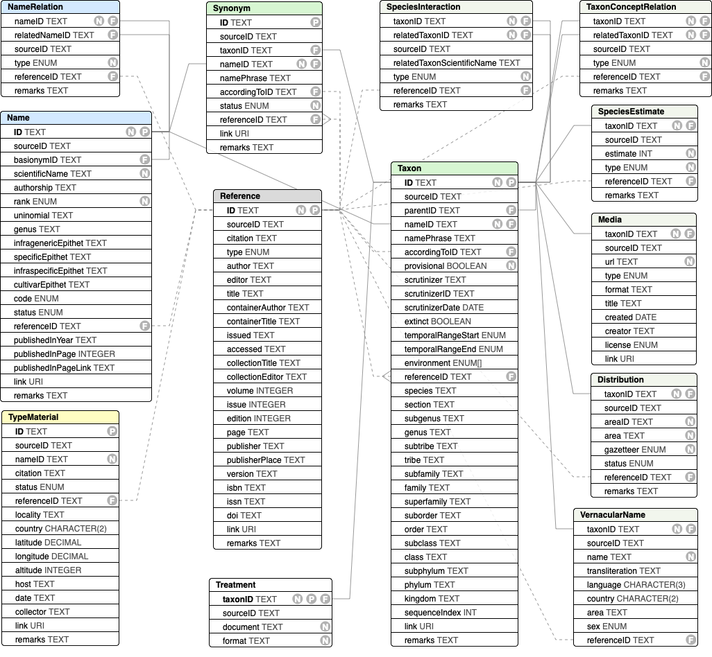

# CoL Data Package (COLDP) Specification
The recommended exchange format for data to and from the CoL Clearinghouse
is a tabular text format with a fixed set of files and columns.

The format is a single ZIP archive that bundles various delimited text files described below together with a metadata.yaml file providing basic metadata about the entire dataset. Each file holds records for the same class of things shown in this diagram:



## Format Comparison

The ColDP format was developed to overcome limitations existing in currently used formats for sharing taxonomic information, namely [Darwin Core Archives](https://dwc.tdwg.org/text/) and the Catalogue of Life submission format also known as [ACEF](http://www.catalogueoflife.org/content/contributing-your-data#ACEF) (Annual Checklist Exchange Format). Darwin Core Archives and ACEF could still be used for exchanging data to and from the Catalogue of Life clearinghouse, but the COLDP format will support the most features. The following table provides an overview of different features supported in each of the 3 formats:

Feature|ACEF|DwC-A|ColDP
 --- |:---:| :---:| :---:
Linnean classification (KPCOFG)|x|x|x
Extended Linnean classification (subranks)|-|-|x
Flexible Parent-child classification|-|x|x
Unrestricted ranks|-|x|x
Higher taxon details|-|x|x
Infraspecific taxa|x|x|x
Nested infraspecific taxa|-|x|x
Basionyms|-|x|x
Synonyms|x|x|x
Synonyms for higher taxa|-|x|x
Name identifier|-|x|x
Nomenclatural status|x|x|x
Fossils/extinction flags|x|x|x
Name & taxon separation|-|-|x
Structured references|x|-|x
Nomenclatural relations|-|-|x
Type species|-|x|x
Type specimen|-|x|*
Taxon concepts|-|x|x
Taxon concept relations|-|x|*
Vernacular names|x|x|x
Structured distributions|x|x|x
Taxon descriptions|-|x|x
Multimedia metadata|-|x|x

 - `+` = supported
 - `-` = not supported
 - `*` = not yet supported but expected soon

## Data Files
The filename for an entity in the above diagram is a case insensitive version of the class name, any number of ignored hyphens or underscores and a known tabular text suffix. 
The suffix specifies one of the two supported tabular flavours, comma separated or tab separated files:

 - `csv`: a comma separated, optionally quoted CSV file as per [RFC 4180](https://tools.ietf.org/html/rfc4180)
 - `tsv`, `tab` or `txt`: indicates a tab seperated file without quoting
 
 Valid examples are `Taxon.tsv` or `vernacular-name.csv`

It is recommended to place all data files in a subfolder called `data`, but having them on the root level is allowed.

### Character Encoding
All files should be encoded in UTF-8.

### Entity listing:
 - metadata.yaml
 - [Name](#name)
 - [NameRel](#namerel)
 - [Taxon](#taxon)
 - [Synonym](#synonym)
 - [Reference](#reference)
 - [Reference JSON-CSL](#reference-json-csl)
 - [Reference BIBTEX](#reference-bibtex)
 - [Description](#description)
 - [Distribution](#distribution)
 - [Media](#media)
 - [VernacularName](#vernacularname)
  
## metadata.yaml
A [YAML file](https://en.wikipedia.org/wiki/YAML) with metadata about the entire dataset should be included. 
The file consists mostly of key value pairs, see the [comments in metadata.yaml](metadata.yaml) for all available keys.
Additional entries to the YAML file is allowed to express non standard properties.


# Data File Columns
All data files should contain a header row that specifies the name of the columns as given below. 
In the absence of a header row it is expected that all columns exist in the exact order given below.
With headers given it is allowed to share additional columns which are not part of the standard as listed below.


## Name
See [NAMES.md](https://github.com/Sp2000/colplus/blob/master/docs/NAMES.md) for examples and rationales.

#### ID
Unique name identifier that is referred to elsewhere via `nameID`.

#### scientificName
Required scientific name excluding the authorship

#### authorship
Authorship of the scientificName

#### rank
type: [rank enum](http://api.col.plus/vocab/rank)

The rank of the name preferrably given in case insensitive english. The recommended vocabulary is included in [rank_enum](http://api.col.plus/vocab/rank).

#### genus
The genus part of a bi/trinomial

#### infragenericEpithet
The infrageneric epithet in case of bi/trinomials. In zoological names often the subgenus.

#### specificEpithet
The specific epithet in case of bi/trinomials.

#### infraspecificEpithet
The infraspecific epithet in case of bi/trinomials.

#### cultivarEpithet
The name of the cultivar for name governed by the cultivar code.

#### appendedPhrase
An optional, unrestricted, lose phrase appended to the name which is not covered by the existing attributes with strict semantics.
Can be used for bacterial strain names or temporary placeholder names for unpublished species.

#### publishedInID
A referenceID pointing to the Reference table indicating the original publication of the name in its given combination

#### publishedInPage
The exact page number within the referenced reference that the original publication of the name in its given combination starts.

#### publishedInYear
The effective year the name was published.

#### code
type: [code enum](http://api.col.plus/vocab/nomCode)

The nomenclatural code the name falls under.

#### original
type: [boolean](https://frictionlessdata.io/specs/table-schema/#boolean)
If true indicates an original name, i.e. a protonym/basionym.
False for all subsequent combinations.

#### status
type: [code enum](http://api.col.plus/vocab/nomStatus)

The broad nomenclatural status of the name.
For the exact status note, e.g. *nomen nudum*, the remarks field should additionally be used

#### link
A link to a webpage provided by the source depicting the name.

#### remarks
Additional nomenclatural remarks about the name. Often indicating its status or relevant rules in the code.


## NameRel
A directed nomenclatural name relation.
See [NAMES.md#name-relations](https://github.com/Sp2000/colplus/blob/master/docs/NAMES.md#name-relations) for examples.

#### nameID 
The name this relation originates from.

#### relatedNameID
The name this relation relates to.

#### type
type: [enum](http://api.col.plus/vocab/nomreltype)

The kind of directed relation.

#### publishedInID
The reference or nomenclatural act where this nomenclatural relation was established.

#### remarks
Remarks about the relation.


## Taxon
An accepted name with a taxonomic classification given either as a parent-child relation or as a flat, denormalized record.

#### ID
Unique taxon identifier that is referred to elsewhere via `taxonID`.

#### parentID
The direct parent in the classification. This is the preferred way of exchanging a hierarchy and takes precedence over any classification given in the denormalized fields.

#### nameID
Pointer to the accepted name referring to an existing Name.ID within this data package.

#### referenceID
A comma concatenated list of reference IDs supporting the taxonomic concept.
Each ID must refer to an existing Reference.ID within this data package.

#### provisional
type: [boolean](https://frictionlessdata.io/specs/table-schema/#boolean)

A flag indicating that the taxon is only provisionally accepted and should be handled with care.

#### accordingTo
The latest scrutinizer who reviewed the taxonomic concept.
In case of multiple scrutinizers concatenate their names with a semicolon.

#### accordingToID
An identifier for the latest scrutinizer who reviewed the taxonomic concept.
Recommended are [ORCID identifier](https://orcid.org/about/) which can be used inside DOI metadata of the CoL.
In case of multiple scrutinizers concatenate the ORCIDs with a semicolon in the same order as the scrutinizers above.

#### accordingToDate 
type: [ISO8601 date](https://frictionlessdata.io/specs/table-schema/#date) 

The date when the taxonomic concept was last reviewed.

#### fossil
type: [boolean](https://frictionlessdata.io/specs/table-schema/#boolean)

Flag indicating that the taxon existed pre holocene in the fossil record.

#### recent 
type: [boolean](https://frictionlessdata.io/specs/table-schema/#boolean)

Flag indicating that the taxon existed during the holocene. This includes species that died out very recently. A taxon can both be recent and fossil.

#### lifezone
type: [enum[]](http://api.col.plus/vocab/lifezone)
A comma delimited list of lifezones this taxon is known to exist in.

#### link
A link to a webpage provided by the source depicting the taxon.

#### remarks
Any further taxonomic remarks.

#### subgenus
The subgenus the taxon is classified in.
If parentID is given this field is ignored.

#### genus
The genus the taxon is classified in.
If parentID is given this field is ignored.

#### subtribe
The subtribe the taxon is classified in.
If parentID is given this field is ignored.

#### tribe
The tribe the taxon is classified in.
If parentID is given this field is ignored.

#### subfamily
The subfamily the taxon is classified in.
If parentID is given this field is ignored.

#### family
The family the taxon is classified in.
If parentID is given this field is ignored.

#### superfamily
The superfamily the taxon is classified in.
If parentID is given this field is ignored.

#### suborder
The suborder the taxon is classified in.
If parentID is given this field is ignored.

#### order
The order the taxon is classified in.
If parentID is given this field is ignored.

#### subclass
The subclass the taxon is classified in.
If parentID is given this field is ignored.

#### class
The class the taxon is classified in.
If parentID is given this field is ignored.

#### subphylum
The subphylum the taxon is classified in.
If parentID is given this field is ignored.

#### phylum
The phylum the taxon is classified in.
If parentID is given this field is ignored.

#### kingdom
The kingdom the taxon is classified in.
If parentID is given this field is ignored.


## Synonym
A synonymous name for a taxon.
Note that the same name can be linked to mulitple taxa by having several Synonym records to model pro parte synonyms.

#### nameID 
Pointer to the synonymous name referring to an existing Name.ID within this data package.

#### taxonID
Pointer to the taxon that this synonym is used for. For pro parte synonyms with multiple accepted names several synonym records sharing the same name but having different taxonIDs should be created. Refers to an existing Taxon.ID within this data package.

#### status 
type: [enum](http://api.col.plus/vocab/taxonomicstatus)

The kind of synonym. One of *synonym*, *ambiguous synonym* or *misapplied*.

#### remarks
Taxonomic remarks


## Reference
Structured bibliographic references with a unique id to refer to from other entities.
References can be given in 3 ways of different degree of atomization that are not mutually exclusive.
The main reference file contains a full citation and 4 Dublin Core based properties that are also used in ACEF.

#### ID  
The local identifier for the reference as used in publishedIn and other fields.

#### citation
Full bibliographic citation as one single string as an alternative to the rest of the more structured fields.
If individual fields are given the full citation can be ignored.

#### author
The author(s) of the work. If multiple authors use a style that can safely be parsed.
Recommended is to list authors by comma and prefix their surname with initials.
If a comma is used to separate surname, firstname please use a semicolon to delimit individual authors.

#### title
The title of the work. In case of journal articles the article title, not the journal itself.

#### year
The year of the publication.

#### source
The title of the journal or book the work was published in. 
The source should exclude volume, edition, pages and other specifics.

#### details
All details to locate the work within the source, sometimes also referred to as collation.
That can include journal volume, edition, pages, pointer to illustrations or anything else.

#### doi
The DOI of the reference

#### link
A URL link to the reference


## Reference JSON-CSL
In addition to the main reference file a `reference.json` file can be added to provide a JSON array of highly structured references
in the [CSL-JSON](https://citeproc-js.readthedocs.io/en/latest/csl-json/markup.html) format, e.g. as provided by CrossRef:
```
curl --location --silent --header "Accept: application/vnd.citationstyles.csl+json" https://doi.org/10.1126/science.169.3946.635
```

The `id` field in each record of the array must correspond to a Reference record with the same `ID` in the CSV file.

#### CSL-JSON example

```
[
{  
   "indexed":{  
      "date-parts":[  
         [  
            2019,
            2,
            16
         ]
      ],
      "date-time":"2019-02-16T13:21:45Z",
      "timestamp":1550323305641
   },
   "reference-count":46,
   "publisher":"Oxford University Press (OUP)",
   "content-domain":{  
      "domain":[  

      ],
      "crossmark-restriction":false
   },
   "published-print":{  
      "date-parts":[  
         [  
            2016
         ]
      ]
   },
   "DOI":"10.1093\/database\/baw125",
   "type":"article-journal",
   "created":{  
      "date-parts":[  
         [  
            2016,
            10,
            3
         ]
      ],
      "date-time":"2016-10-03T08:40:07Z",
      "timestamp":1475484007000
   },
   "page":"baw125",
   "source":"Crossref",
   "is-referenced-by-count":12,
   "title":"The Global Genome Biodiversity Network (GGBN) Data Standard specification",
   "prefix":"10.1093",
   "volume":"2016",
   "author":[  
      {  
         "given":"G.",
         "family":"Droege",
         "sequence":"first",
         "affiliation":[  

         ]
      },
      {  
         "given":"K.",
         "family":"Barker",
         "sequence":"additional",
         "affiliation":[  

         ]
      },
      {  
         "given":"O.",
         "family":"Seberg",
         "sequence":"additional",
         "affiliation":[  

         ]
      },
      {  
         "given":"J.",
         "family":"Coddington",
         "sequence":"additional",
         "affiliation":[  

         ]
      },
      {  
         "given":"E.",
         "family":"Benson",
         "sequence":"additional",
         "affiliation":[  

         ]
      },
      {  
         "given":"W. G.",
         "family":"Berendsohn",
         "sequence":"additional",
         "affiliation":[  

         ]
      },
      {  
         "given":"B.",
         "family":"Bunk",
         "sequence":"additional",
         "affiliation":[  

         ]
      },
      {  
         "given":"C.",
         "family":"Butler",
         "sequence":"additional",
         "affiliation":[  

         ]
      },
      {  
         "given":"E. M.",
         "family":"Cawsey",
         "sequence":"additional",
         "affiliation":[  

         ]
      },
      {  
         "given":"J.",
         "family":"Deck",
         "sequence":"additional",
         "affiliation":[  

         ]
      },
      {  
         "given":"M.",
         "family":"D\u00f6ring",
         "sequence":"additional",
         "affiliation":[  

         ]
      },
      {  
         "given":"P.",
         "family":"Flemons",
         "sequence":"additional",
         "affiliation":[  

         ]
      },
      {  
         "given":"B.",
         "family":"Gemeinholzer",
         "sequence":"additional",
         "affiliation":[  

         ]
      },
      {  
         "given":"A.",
         "family":"G\u00fcntsch",
         "sequence":"additional",
         "affiliation":[  

         ]
      },
      {  
         "given":"T.",
         "family":"Hollowell",
         "sequence":"additional",
         "affiliation":[  

         ]
      },
      {  
         "given":"P.",
         "family":"Kelbert",
         "sequence":"additional",
         "affiliation":[  

         ]
      },
      {  
         "given":"I.",
         "family":"Kostadinov",
         "sequence":"additional",
         "affiliation":[  

         ]
      },
      {  
         "given":"R.",
         "family":"Kottmann",
         "sequence":"additional",
         "affiliation":[  

         ]
      },
      {  
         "given":"R. T.",
         "family":"Lawlor",
         "sequence":"additional",
         "affiliation":[  

         ]
      },
      {  
         "given":"C.",
         "family":"Lyal",
         "sequence":"additional",
         "affiliation":[  

         ]
      },
      {  
         "given":"J.",
         "family":"Mackenzie-Dodds",
         "sequence":"additional",
         "affiliation":[  

         ]
      },
      {  
         "given":"C.",
         "family":"Meyer",
         "sequence":"additional",
         "affiliation":[  

         ]
      },
      {  
         "given":"D.",
         "family":"Mulcahy",
         "sequence":"additional",
         "affiliation":[  

         ]
      },
      {  
         "given":"S. Y.",
         "family":"Nussbeck",
         "sequence":"additional",
         "affiliation":[  

         ]
      },
      {  
         "given":"\u00c9.",
         "family":"O'Tuama",
         "sequence":"additional",
         "affiliation":[  

         ]
      },
      {  
         "given":"T.",
         "family":"Orrell",
         "sequence":"additional",
         "affiliation":[  

         ]
      },
      {  
         "given":"G.",
         "family":"Petersen",
         "sequence":"additional",
         "affiliation":[  

         ]
      },
      {  
         "given":"T.",
         "family":"Robertson",
         "sequence":"additional",
         "affiliation":[  

         ]
      },
      {  
         "given":"C.",
         "family":"S\u00f6hngen",
         "sequence":"additional",
         "affiliation":[  

         ]
      },
      {  
         "given":"J.",
         "family":"Whitacre",
         "sequence":"additional",
         "affiliation":[  

         ]
      },
      {  
         "given":"J.",
         "family":"Wieczorek",
         "sequence":"additional",
         "affiliation":[  

         ]
      },
      {  
         "given":"P.",
         "family":"Yilmaz",
         "sequence":"additional",
         "affiliation":[  

         ]
      },
      {  
         "given":"H.",
         "family":"Zetzsche",
         "sequence":"additional",
         "affiliation":[  

         ]
      },
      {  
         "given":"Y.",
         "family":"Zhang",
         "sequence":"additional",
         "affiliation":[  

         ]
      },
      {  
         "given":"X.",
         "family":"Zhou",
         "sequence":"additional",
         "affiliation":[  

         ]
      }
   ],
   "member":"286",
   "published-online":{  
      "date-parts":[  
         [  
            2016,
            10,
            2
         ]
      ]
   },
   "reference":[  
      {  
         "key":"2016100301395315000_2016.0.baw125.1",
         "DOI":"10.1093\/nar\/gkt928",
         "doi-asserted-by":"publisher"
      },
      {  
         "key":"2016100301395315000_2016.0.baw125.2",
         "DOI":"10.1371\/journal.pone.0029715",
         "doi-asserted-by":"publisher"
      },
      {  
         "key":"2016100301395315000_2016.0.baw125.3",
         "DOI":"10.1080\/11263504.2012.740085",
         "doi-asserted-by":"publisher"
      },
      {  
         "key":"2016100301395315000_2016.0.baw125.4",
         "DOI":"10.1038\/nbt.1823",
         "doi-asserted-by":"publisher"
      },
      {  
         "key":"2016100301395315000_2016.0.baw125.5",
         "DOI":"10.1101\/SQB.1986.051.01.032",
         "doi-asserted-by":"publisher"
      },
      {  
         "key":"2016100301395315000_2016.0.baw125.6",
         "DOI":"10.1073\/pnas.74.12.5463",
         "doi-asserted-by":"publisher"
      },
      {  
         "key":"2016100301395315000_2016.0.baw125.7",
         "DOI":"10.1016\/j.molcel.2015.05.004",
         "doi-asserted-by":"publisher"
      },
      {  
         "key":"2016100301395315000_2016.0.baw125.8",
         "unstructured":"Lav\u00edn Trueba J.L. Aransay A.M. (2016) The high-throughput sequencing technologies triple-W discussion: why use HTS, what is the optimal HTS method to use, and which data analysis workflow to follow. In: Lav\u00edn Trueba J.L. Aransay A.M. (eds.) Field Guidelines for Genetic Experimental Designs in High-Throughput Sequencing. Springer International Publishing. pp. 1\u201312.",
         "DOI":"10.1007\/978-3-319-31350-4_1",
         "doi-asserted-by":"crossref"
      },
      {  
         "key":"2016100301395315000_2016.0.baw125.9",
         "first-page":"433",
         "article-title":"Mitochondrial DNA extraction and sequencing of formalin-fixed archival snake tissue",
         "volume":"19",
         "author":"Friedman",
         "year":"2008",
         "journal-title":"Mitochondrial DNA"
      },
      {  
         "key":"2016100301395315000_2016.0.baw125.10",
         "first-page":"e2202v1",
         "article-title":"Greater than X kb: a quantitative assessment of preservation conditions on genomic DNA quality, and a proposed standard for genome-quality DNA",
         "volume":"4",
         "author":"Mulcahy",
         "year":"2016",
         "journal-title":"PeerJ Preprints"
      },
      {  
         "key":"2016100301395315000_2016.0.baw125.11",
         "DOI":"10.1038\/nature09678",
         "doi-asserted-by":"publisher"
      },
      {  
         "key":"2016100301395315000_2016.0.baw125.12",
         "DOI":"10.1006\/jmbi.1990.9999",
         "doi-asserted-by":"publisher"
      },
      {  
         "key":"2016100301395315000_2016.0.baw125.13",
         "doi-asserted-by":"crossref",
         "first-page":"D15",
         "DOI":"10.1093\/nar\/gkq1150",
         "article-title":"The international nucleotide sequence database collaboration",
         "volume":"3",
         "author":"Cochrane",
         "year":"2011",
         "journal-title":"Nucleic Acids Res"
      },
      {  
         "key":"2016100301395315000_2016.0.baw125.14",
         "doi-asserted-by":"crossref",
         "first-page":"273",
         "DOI":"10.1098\/rspb.2007.1290",
         "article-title":"Character-based DNA barcoding allows discrimination of genera, species and populations in Odonata",
         "volume":"275",
         "author":"Rach",
         "year":"2008",
         "journal-title":"Proc. R. Soc. B"
      },
      {  
         "key":"2016100301395315000_2016.0.baw125.15",
         "DOI":"10.1007\/s00216-014-8435-y",
         "doi-asserted-by":"publisher"
      },
      {  
         "key":"2016100301395315000_2016.0.baw125.16",
         "DOI":"10.3897\/zookeys.365.6027",
         "doi-asserted-by":"publisher"
      },
      {  
         "key":"2016100301395315000_2016.0.baw125.17",
         "DOI":"10.1126\/science.1251385",
         "doi-asserted-by":"publisher"
      },
      {  
         "key":"2016100301395315000_2016.0.baw125.18",
         "DOI":"10.3897\/zookeys.152.2473",
         "doi-asserted-by":"publisher"
      },
      {  
         "key":"2016100301395315000_2016.0.baw125.19",
         "first-page":"1",
         "article-title":"How to tackle the molecular species inventory for an industrialized natio\u2013n\u2014lessons from the first phase of the German Barcode of Life initiative GBOL (2012\u20132015)",
         "volume":"17",
         "author":"Geiger",
         "year":"2016",
         "journal-title":"Genome"
      },
      {  
         "key":"2016100301395315000_2016.0.baw125.20",
         "DOI":"10.1038\/nature08656",
         "doi-asserted-by":"publisher"
      },
      {  
         "key":"2016100301395315000_2016.0.baw125.21",
         "unstructured":"Dessauer H.C. Hafner M.S. (1984) Collection of Frozen Tissues: Value,Management, Field and Laboratory Procedures, and Directory of Existing Collections. Association of Systematics Collections: Lawrence."
      },
      {  
         "key":"2016100301395315000_2016.0.baw125.22",
         "unstructured":"Engstrom M.D. Murphy R.W. Haddrath O. (1990) Sampling vertebrate collections for molecular research: practice and policies. In: Metsger D.A. Byers S.C. (eds), Managing the Modern Herbarium. Elton-Wolf, Vancouver. pp. 315\u2013330."
      },
      {  
         "key":"2016100301395315000_2016.0.baw125.23",
         "unstructured":"de Vincente M.C. Andersson M.S. (2006) DNA banks\u2014providing novel options for genebanks. Topical Reviews in Agricultural Biodiversity. International Plant Genetic Resources Institute, Rome."
      },
      {  
         "key":"2016100301395315000_2016.0.baw125.24",
         "unstructured":"OECD (Organisation for economic co-operation and development) (2001) Biological Resource Centres\u2014Underpinning the future of life sciences and biotechnology. http:\/\/www.oecd.org\/sti\/biotech\/2487422.pdf."
      },
      {  
         "key":"2016100301395315000_2016.0.baw125.25",
         "unstructured":"OECD (Organisation for economic co-operation and development) (2007) Best practice guidelines for biological resource centres. http:\/\/www.oecd.org\/sti\/biotech\/38777417.pdf."
      },
      {  
         "key":"2016100301395315000_2016.0.baw125.26",
         "first-page":"47",
         "article-title":"The Nagoya Protocol on Access to Genetic Resources and the Fair and Equitable Sharing of Benefits Arising from their Utilization to the Convention on Biological Diversity",
         "volume":"20",
         "author":"Buck",
         "year":"2011",
         "journal-title":"Reciel"
      },
      {  
         "key":"2016100301395315000_2016.0.baw125.27",
         "unstructured":"Butler C. Lyal C. Seberg O. (2015) GGBN creates access and benefit sharing documentation for members. GGBN Newsletter, March 2015. http:\/\/ggbn.org\/docs\/GGBN_March2015_Newsletter_FINAL.pdf."
      },
      {  
         "key":"2016100301395315000_2016.0.baw125.28",
         "doi-asserted-by":"crossref",
         "first-page":"1181",
         "DOI":"10.1038\/ng1007-1181",
         "article-title":"The NCBI dbGaP database of genotypes and phenotypes",
         "volume":"39",
         "author":"Mailman",
         "year":"2007",
         "journal-title":"Nat. Genet"
      },
      {  
         "key":"2016100301395315000_2016.0.baw125.29",
         "DOI":"10.1038\/nature09298",
         "doi-asserted-by":"publisher"
      },
      {  
         "key":"2016100301395315000_2016.0.baw125.30",
         "DOI":"10.1093\/nar\/gkt1211",
         "doi-asserted-by":"publisher"
      },
      {  
         "key":"2016100301395315000_2016.0.baw125.31",
         "DOI":"10.1038\/nature05874",
         "doi-asserted-by":"publisher"
      },
      {  
         "key":"2016100301395315000_2016.0.baw125.32",
         "DOI":"10.1002\/cncy.20147",
         "doi-asserted-by":"publisher"
      },
      {  
         "key":"2016100301395315000_2016.0.baw125.33",
         "DOI":"10.1158\/1055-9965.EPI-09-1268",
         "doi-asserted-by":"publisher"
      },
      {  
         "key":"2016100301395315000_2016.0.baw125.34",
         "DOI":"10.1089\/bio.2012.0012",
         "doi-asserted-by":"publisher"
      },
      {  
         "key":"2016100301395315000_2016.0.baw125.35",
         "DOI":"10.1089\/bio.2011.0035",
         "doi-asserted-by":"publisher"
      },
      {  
         "key":"2016100301395315000_2016.0.baw125.36",
         "first-page":"277",
         "article-title":"Can biospecimen science expedite the ex situ conservation of plants in megadiverse countries? A focus on the flora of brazil",
         "volume":"34",
         "author":"Harding",
         "year":"2013",
         "journal-title":"Crit. Rev. Plant. Sci"
      },
      {  
         "key":"2016100301395315000_2016.0.baw125.37",
         "DOI":"10.1038\/nbt1360",
         "doi-asserted-by":"publisher"
      },
      {  
         "key":"2016100301395315000_2016.0.baw125.38",
         "DOI":"10.1016\/j.resmic.2010.02.005",
         "doi-asserted-by":"publisher"
      },
      {  
         "key":"2016100301395315000_2016.0.baw125.39",
         "DOI":"10.1089\/bio.2010.0029",
         "doi-asserted-by":"publisher"
      },
      {  
         "key":"2016100301395315000_2016.0.baw125.40",
         "first-page":"552",
         "article-title":"International networking of large amounts of primary biodiversity data. Proceedings Informatik 2009 - Im Focus das Leben",
         "volume":"26",
         "author":"Holetschek",
         "year":"2009",
         "journal-title":"Lect. Notes Inf"
      },
      {  
         "key":"2016100301395315000_2016.0.baw125.41",
         "DOI":"10.1089\/omi.2008.0A10",
         "doi-asserted-by":"publisher"
      },
      {  
         "key":"2016100301395315000_2016.0.baw125.42",
         "DOI":"10.5301\/JBM.2012.9718",
         "doi-asserted-by":"publisher"
      },
      {  
         "key":"2016100301395315000_2016.0.baw125.43",
         "DOI":"10.1089\/bio.2012.0033",
         "doi-asserted-by":"publisher"
      },
      {  
         "key":"2016100301395315000_2016.0.baw125.44",
         "DOI":"10.1371\/journal.pone.0102623",
         "doi-asserted-by":"publisher"
      },
      {  
         "key":"2016100301395315000_2016.0.baw125.45",
         "doi-asserted-by":"crossref",
         "first-page":"e014224.",
         "DOI":"10.1371\/journal.pone.0142240",
         "article-title":"B-HIT\u2014a tool for harvesting and indexing biodiversity data",
         "volume":"10",
         "author":"Kelbert",
         "year":"2015",
         "journal-title":"PLoS One"
      },
      {  
         "key":"2016100301395315000_2016.0.baw125.46",
         "DOI":"10.1089\/bio.2015.0061",
         "doi-asserted-by":"publisher"
      }
   ],
   "container-title":"Database",
   "original-title":[  

   ],
   "language":"en",
   "link":[  
      {  
         "URL":"http:\/\/academic.oup.com\/database\/article-pdf\/doi\/10.1093\/database\/baw125\/8225125\/baw125.pdf",
         "content-type":"unspecified",
         "content-version":"vor",
         "intended-application":"similarity-checking"
      }
   ],
   "deposited":{  
      "date-parts":[  
         [  
            2017,
            8,
            25
         ]
      ],
      "date-time":"2017-08-25T02:23:14Z",
      "timestamp":1503627794000
   },
   "score":1.0,
   "subtitle":[  

   ],
   "short-title":[  

   ],
   "issued":{  
      "date-parts":[  
         [  
            2016
         ]
      ]
   },
   "references-count":46,
   "alternative-id":[  
      "10.1093\/database\/baw125"
   ],
   "URL":"http:\/\/dx.doi.org\/10.1093\/database\/baw125",
   "relation":{  
      "cites":[  

      ]
   },
   "ISSN":[  
      "1758-0463"
   ],
   "container-title-short":"Database"
},

{  
   "indexed":{  
      "date-parts":[  
         [  
            2019,
            2,
            16
         ]
      ],
      "date-time":"2019-02-16T05:39:49Z",
      "timestamp":1550295589144
   },
   "reference-count":0,
   "publisher":"American Association for the Advancement of Science (AAAS)",
   "issue":"3946",
   "content-domain":{  
      "domain":[  

      ],
      "crossmark-restriction":false
   },
   "published-print":{  
      "date-parts":[  
         [  
            1970,
            8,
            14
         ]
      ]
   },
   "DOI":"10.1126\/science.169.3946.635",
   "type":"article-journal",
   "created":{  
      "date-parts":[  
         [  
            2006,
            10,
            5
         ]
      ],
      "date-time":"2006-10-05T12:56:56Z",
      "timestamp":1160053016000
   },
   "page":"635-641",
   "source":"Crossref",
   "is-referenced-by-count":61,
   "title":"The Structure of Ordinary Water: New data and interpretations are yielding new insights into this fascinating substance",
   "prefix":"10.1126",
   "volume":"169",
   "author":[  
      {  
         "given":"H. S.",
         "family":"Frank",
         "sequence":"first",
         "affiliation":[  

         ]
      }
   ],
   "member":"221",
   "container-title":"Science",
   "original-title":[  

   ],
   "language":"en",
   "link":[  
      {  
         "URL":"https:\/\/syndication.highwire.org\/content\/doi\/10.1126\/science.169.3946.635",
         "content-type":"unspecified",
         "content-version":"vor",
         "intended-application":"similarity-checking"
      }
   ],
   "deposited":{  
      "date-parts":[  
         [  
            2016,
            12,
            23
         ]
      ],
      "date-time":"2016-12-23T19:54:07Z",
      "timestamp":1482522847000
   },
   "score":1.0,
   "subtitle":[  

   ],
   "short-title":[  

   ],
   "issued":{  
      "date-parts":[  
         [  
            1970,
            8,
            14
         ]
      ]
   },
   "references-count":0,
   "journal-issue":{  
      "published-print":{  
         "date-parts":[  
            [  
               1970,
               8,
               14
            ]
         ]
      },
      "issue":"3946"
   },
   "URL":"http:\/\/dx.doi.org\/10.1126\/science.169.3946.635",
   "relation":{  

   },
   "ISSN":[  
      "0036-8075",
      "1095-9203"
   ],
   "container-title-short":"Science"
}
]
```

## Reference BIBTEX
Alternatively to CSL-JSON a [BibTex](http://www.bibtex.org/Format/) file `reference.bib` can be given to provide highly structured citations.
The id field following the curly opening bracket must correspond to a record ID from the reference.csv file.


#### Bibtex example
```
 @article{Droege_2016, 
 	title={The Global Genome Biodiversity Network (GGBN) Data Standard specification}, 
 	volume={2016}, 
 	ISSN={1758-0463}, 
 	url={http://dx.doi.org/10.1093/database/baw125}, 
 	DOI={10.1093/database/baw125}, 
 	journal={Database}, 
 	publisher={Oxford University Press (OUP)}, 
 	author={Droege, G. and Barker, K. and Seberg, O. and Coddington, J. and Benson, E. and Berendsohn, W. G. and Bunk, B. and Butler, C. and Cawsey, E. M. and Deck, J. and et al.}, 
 	year={2016}, 
 	pages={baw125}
}

@article{Frank_1970, 
 	title     = {The Structure of Ordinary Water: New data and interpretations are yielding new insights into this fascinating substance}, 
 	volume    = {169}, 
 	ISSN      = {1095-9203}, 
 	url       = {http://dx.doi.org/10.1126/science.169.3946.635}, 
 	DOI       = {10.1126/science.169.3946.635}, 
 	number    = {3946}, 
 	journal   = {Science}, 
 	publisher = {American Association for the Advancement of Science (AAAS)}, 
 	author    = {Frank, H. S.}, 
 	year      = {1970}, 
 	month     = {Aug}, 
 	pages     = {635–641}
}
```

## Description

#### taxonID 
Pointer to the taxon referring to an existing Taxon.ID within this data package.

#### category ENUM
#### description 
#### language
ISO 3 letter code

#### referenceID
Pointer to the reference that is the source of this description. Refers to an existing Reference.ID within this data package.


## Distribution
A structured distribution record for a taxon in a given area.

#### taxonID 
Pointer to the taxon referring to an existing Taxon.ID within this data package.

#### area 
The geographic area this distribution record is about.

#### gazetteer
type: [enum](http://api.col.plus/vocab/gazetteer)

The geographic gazetteer the area is defined in.

#### status 
type: [enum](http://api.col.plus/vocab/distributionstatus)
Distribution status.

#### referenceID
Pointer to the reference that supports this distribution. Refers to an existing Reference.ID within this data package.


## Media
Multimedia items for a taxon such as an image, audio or video.

#### taxonID 
Pointer to the taxon referring to an existing Taxon.ID within this data package.

#### url 
The URL that resolves to the media item itself, not a webpage that depicts it.

#### type
The MIME-type of the media item the url identifies.
Preferrably the full type/subtype combination, e.g `image/jpeg`, but the primary type alone is sufficient (`image`, `video`, `audio`).

#### title
Optional title for the item.

#### created
type: [ISO8601 date](https://frictionlessdata.io/specs/table-schema/#date) 
Date the media item was recorded.

#### creator
Author of the media item.

#### license
type: [license](http://api.col.plus/vocab/license) 

#### link
Optional webpage from the source this media item is shown on.


## VernacularName
A vernacular or common name for a taxon.

#### taxonID 
Pointer to the taxon referring to an existing Taxon.ID within this data package.

#### name 
The vernacular name in the original script.

#### transliteration
An optional transliteration of the verncular name into the latin script.

#### language
Language of the vernacular name given as an ISO 3 letter code.

#### country CHARACTER2
Country this vernacular name is used in given as an ISO 2 letter code.

#### lifeStage
Optional life stage of the organism this vernacular name is restricted to.

#### sex
type: [enum](http://api.col.plus/vocab/sex)

Optional sex of the organism this vernacular name is restricted to.

#### referenceID
Pointer to the reference that supports this vernacular name. Refers to an existing Reference.ID within this data package.
